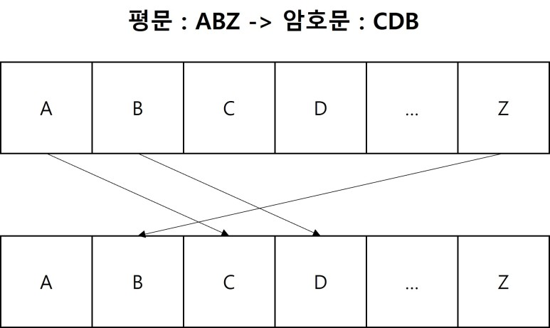

# 01. 카이사르(시저) 암호 (Caesar Cipher)

기원전 44년 줄리어스 카이사르(Gaius Julius Caesar)가 사용한 암호는 평문의 각 알파벳을 일정한 거리만큼 밀어서 다른 알파벳으로 치환하는 암호



# **INDEX**

**1. [암호화](#암호화)**

**2. [복호화](#복호화)**

**3. [Brute Force](#Brute-Force)**

# **암호화**

```py
import string

class Caesar_Cipher:
    def __init__(self, shift : int = 28):
        self.shift      = shift

    def encrypt(self, data : str):
        assert not data, '암호화할 데이터가 존재하지 않습니다.'
        assert len(data) > 0, '암호화할 데이터가 존재하지 않습니다.'
    def decrypt(self, data : str):
        assert not data, '복호화할 데이터가 존재하지 않습니다.'
        assert len(data) <= 0, '복호화할 데이터가 존재하지 않습니다.'

    def run(self, encrypt=True):
        if len(self.input) < 0: return self.input
        if self.shift > len(string.ascii_uppercase): self.shift = self.shift % len(string.ascii_uppercase)
        result      = ''
        for c in self.input:
            alphabet    = string.ascii_uppercase if c.isupper() else ( string.ascii_lowercase if c.islower() else None )
            if alphabet:
                new_index = (alphabet.find(c) + self.shift) % len(alphabet) if encrypt else alphabet.find(c) - self.shift
                result += alphabet[new_index]
            else: result += c
        return result

original_data   = "Hello World"
caesar          = Caesar_Cipher()
caesar.input    = original_data
caesar.shift    = 28

encrypted       = caesar.run()
caesar.input    = encrypted
decrypted       = caesar.run(encrypt=False)
print(original_data, '->', encrypted)
print(encrypted, '->', decrypted)
```

# **복호화**

# **Brute Force**