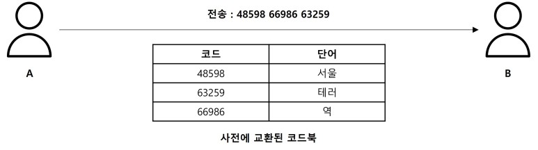
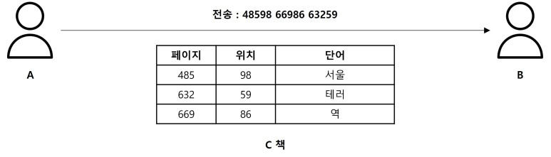

# 코드북 암호 (CodeBook Cipher)

사전에 숫자와 단어의 쌍으로 이루어진 코드북(난수표)을 만들어서 암호문을 교환하는 것으로 해독이 어렵고 안전성이 높은 암호

사전에 약속된 테이블을 통해 숫자를 받으면 단어를 매핑하여 복호화할 수 았다.

혹은 코드북을 따로 만들지 않고, 주변에서 구할 수 있는 책 등을 통해 암호문을 전송할 수 있다.

예를 들어 C라는 책이 있고, 485페이지의 98번째에 나오는 단어가 서울이라면 48598을 전송하면 수신자는 서울이라는 단어로 해석이 가능하다.

코드북을 모르면 복호화하기 매우 어렵기 때문에 [난수방송](https://namu.wiki/w/%EB%82%9C%EC%88%98%EB%B0%A9%EC%86%A1/%EB%B6%81%ED%95%9C)에서 사용된다.