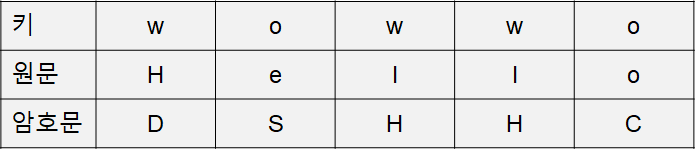

# 비즈네르 암호 (Vigenère Cipher)

비즈네르 암호의 장점은 [빈도분석](https://ko.wikipedia.org/wiki/%EB%B9%88%EB%8F%84%EB%B6%84%EC%84%9D_(%EC%95%94%ED%98%B8))으로 해독이 거의 불가능하다는 사실이다. 또한, 열쇠의 개수가 무궁무진하다는 것도 큰 장점인 암호이다.

비즈네르 표가 다음과 같다고 가정하자.


카이사르(시저) 암호와 마찬가지로 쉬프트를 이용하여 암호화 시키면 된다. 다만 쉬프트 값이 일정하지 않다는 것이다.

이때 원문이 Hello이고, 키가 wow이면 암호문은 DSHHC가 된다.



카이사르 암호화 방식으로 이루어지기 때문에 다음과 같이 암/복호화를 해본다.

```py
class Caesar_Cipher:
    def __init__(self, shift : int = 0):
        self.shift      = shift
        self.digits     = '0123456789'
        self.uppercase  = 'ABCDEFGHIJKLMNOPQRSTUVWXYZ'
        self.lowercase  = 'abcdefghijklmnopqrstuvwxyz'

    def encrypt(self, data : str):
        assert data, '암호화할 데이터가 존재하지 않습니다.'
        assert len(data) > 0, '암호화할 데이터가 존재하지 않습니다.'
        result  = ''
        for d in data:
            if self.digits[0] <= d <= self.digits[-1]:
                result += self.digits[(self.digits.find(d) + (self.shift % len(self.digits))) % len(self.digits)]
            elif self.uppercase[0] <= d <= self.uppercase[-1]:
                result += self.uppercase[(self.uppercase.find(d) + (self.shift % len(self.uppercase))) % len(self.uppercase)]
            elif self.lowercase[0] <= d <= self.lowercase[-1]:
                result += self.lowercase[(self.lowercase.find(d) + (self.shift % len(self.lowercase))) % len(self.lowercase)]
            else: result += d
        return result

    def decrypt(self, data : str):
        assert data, '복호화할 데이터가 존재하지 않습니다.'
        assert len(data) > 0, '복호화할 데이터가 존재하지 않습니다.'
        result  = ''
        for d in data:
            if self.digits[0] <= d <= self.digits[-1]:
                result += self.digits[self.digits.find(d) - (self.shift % len(self.digits))]
            elif self.uppercase[0] <= d <= self.uppercase[-1]:
                result += self.uppercase[self.uppercase.find(d) - (self.shift % len(self.uppercase))]
            elif self.lowercase[0] <= d <= self.lowercase[-1]:
                result += self.lowercase[self.lowercase.find(d) - (self.shift % len(self.lowercase))]
            else: result += d
        return result

KEY         = 'Hello'
PlainText   = 'Vigenere ciPheR'
caesar      = Caesar_Cipher()

EncryptText = ''
for i, p in enumerate(PlainText):
    caesar.shift = caesar.uppercase.find(KEY[i % len(KEY)].upper())
    EncryptText += caesar.encrypt(data=p)
print('Encrypt : {}'.format(EncryptText))

DecryptText = ''
for i, e in enumerate(EncryptText):
    caesar.shift = caesar.uppercase.find(KEY[i % len(KEY)].upper())
    DecryptText += caesar.decrypt(data=e)
print('Decrypt : {}'.format(DecryptText))
```