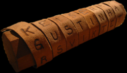

# 스키테일 암호 (Scytale Cipher)

스파르타에서는 전쟁터에 나가있는 군대에 비밀메시지를 전할 때 암호

평범한 일정한 너비의 종이테이프를 원통(막대)에 서로 겹치지 않도록 감아, 테이프 위에 세로쓰기로 통신문을 기입하는 방식이며, 테이프를 풀어 보아서는 내용을 전혀 판독할 수 없으나, 통신문을 기록할 때 사용한 것과 생김새가 같고 동일한 지름을 가진 원통에 감아보면 내용을 읽을 수 있다.



다음과 같이 암복호화를 해본다.

```py
import math

class Scytale:
    def __init__(self, size : int = 0):
        self.size = size

    def encrypt(self, data : str):
        ROWS    = math.ceil(len(data) / self.size)
        DICT    = [data[i*ROWS:(i + 1)*ROWS] for i in range(self.size)]
        return ''.join([d[i] if len(d) > i else '' for i in range(ROWS) for d in DICT])

    def decrypt(self, data : str):
        ROWS    = math.ceil(len(data) / self.size)
        return ''.join([data[i+(r * self.size)] if i+(r * self.size) < len(data) else '' for i in range(self.size) for r in range(ROWS)])


PlainText   = 'let\'s meet at eleven in the evening'
scytale     = Scytale(size=4)

EncrypText  = scytale.encrypt(data=PlainText)
print(EncrypText)
DecryptText = scytale.decrypt(data=EncrypText)
print(DecryptText)
```