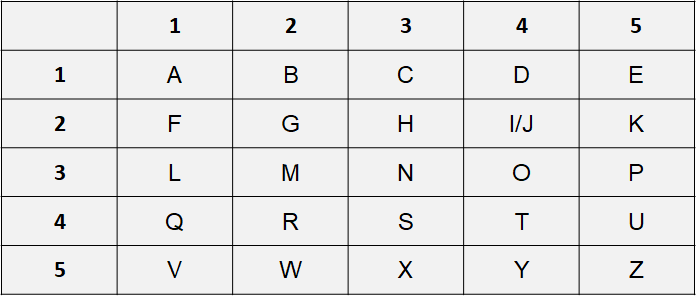
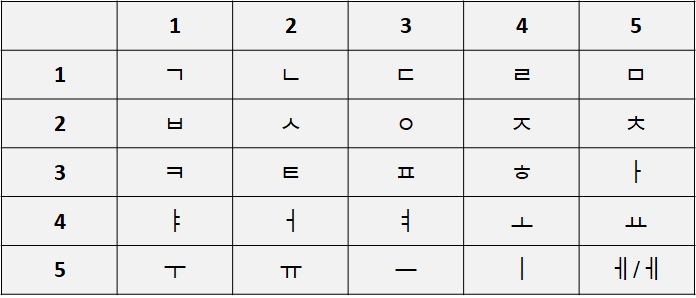

# 폴리비오스 암호 (Polibius Cipher)

고대 그리스의 역사가인 폴리비오스에 의해서 발명된 치환 암호

로마자 알파벳을 사용한 표를 다음과 같이 정의한다고 가정할때, hello라는 글자를 암호화할 때는 23 15 31 31 34와 같이 쓴다.

한글로 이루어진 폴리비오스 암호표를 만들어 본다.

표의 행과 열을 변형해서도 표를 만들 수 있다.

​