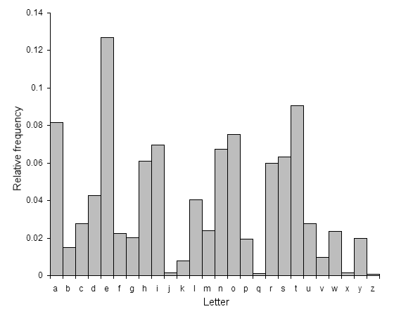

# 빈도수 분석 (Frequency Analysis)

평문과 암호문에 사용되는 문자 또는 문자열의 출현빈도를 단서로 이용하는 암호 해독법

영문에서는 e가 가장 많이 사용되므로, 암호문에서의 특정 글자가 많이 보인다면, 그 글자는 e에서 치환되었을 가능성이 높다.



다음과 같은 암호문이 있다고 가정한다.

```
MeYLGVIWAMeYOPINYZGWYeGMZRUUYPZAIXILGVSIZZMPGKKD
WOMePGROeIWGPCeIPAMDKKeYCIUYMGIFRWCeGLOPINYZHRZM
PDNYWDWOGWITDWYSeDCeeIAFYYWMPIDWYAGTYPIKGLMXFPI
WCeHRZMMeYMeDWOMGQRYWCeUXMeDPZMQRGMeeYAPISDWO
FICJILYSNICYZeYMGGJIPRWIWAIHRUNIWAHRZMUDZZYAMeYFRW
CeMRPWDWOPGRWAIOIDWSDMeIGWYMSGMePYYeYHRUNYARNF
RMSDMeWGOPYIMYPZRCCYZZIOIDWIWAIOIDWeYMPDYAILMYPM
eYMWUNMDWOUGPZYKFRMIMKIZMeIAMGODTYDMRNIWASIKJYAI
SIXSDMeeDZWGZYDWMeYIDPZIXDWODIUZRPYMeYXIPYZGRPDM
DZYIZXMGAYZNDZYSeIMXGRCIWWGMOYM
```

대소문자를 통일해준다.

```
MEYLGVIWAMEYOPINYZGWYEGMZRUUYPZAIXILGVSIZZMPGKKD
WOMEPGROEIWGPCEIPAMDKKEYCIUYMGIFRWCEGLOPINYZHRZM
PDNYWDWOGWITDWYSEDCEEIAFYYWMPIDWYAGTYPIKGLMXFPI
WCEHRZMMEYMEDWOMGQRYWCEUXMEDPZMQRGMEEYAPISDWO
FICJILYSNICYZEYMGGJIPRWIWAIHRUNIWAHRZMUDZZYAMEYFRW
CEMRPWDWOPGRWAIOIDWSDMEIGWYMSGMEPYYEYHRUNYARNF
RMSDMEWGOPYIMYPZRCCYZZIOIDWIWAIOIDWEYMPDYAILMYPM
EYMWUNMDWOUGPZYKFRMIMKIZMEIAMGODTYDMRNIWASIKJYAI
SIXSDMEEDZWGZYDWMEYIDPZIXDWODIUZRPYMEYXIPYZGRPDM
DZYIZXMGAYZNDZYSEIMXGRCIWWGMOYM
```

먼저 [알파벳의 빈도수를 구하면](https://www.browserling.com/tools/letter-frequency) 다음과 같이 I가 가장 많이 나왔고, 그 다음으로 Y가 가장 많이 나왔다.

I를 e로 치환했을 땐, 감을 잡을 수 없고, [100 Most Common Words](https://www.englishclub.com/vocabulary/common-words-100.htm), [1000 MOST COMMON ENGLISH WORDS](https://1000mostcommonwords.com/1000-most-common-english-words/), [Word frequency data](https://www.wordfrequency.info/samples.asp) 등 단어의 빈도수와 배치등을 고려하면 Y를 e로 변경했을 때 MEe가 the가 될 수 있을거라는 가능성이 생긴다. 따라서 M과 E를 각 각 t와 h로 치환해본다.

```
theLGVIWAtheOPINeZGWehGtZRUUePZAIXILGVSIZZtPGKKD
WOthPGROhIWGPChIPAtDKKheCIUetGIFRWChGLOPINeZHRZt
PDNeWDWOGWITDWeShDChhIAFeeWtPIDWeAGTePIKGLtXFPI
WChHRZtthethDWOtGQReWChUXthDPZtQRGthheAPISDWO
FICJILeSNICeZhetGGJIPRWIWAIHRUNIWAHRZtUDZZeAtheFRW
ChtRPWDWOPGRWAIOIDWSDthIGWetSGthPeeheHRUNeARNF
RtSDthWGOPeItePZRCCeZZIOIDWIWAIOIDWhetPDeAILtePt
hetWUNtDWOUGPZeKFRtItKIZthIAtGODTeDtRNIWASIKJeAI
SIXSDthhDZWGZeDWtheIDPZIXDWODIUZRPetheXIPeZGRPDt
DZeIZXtGAeZNDZeShItXGRCIWWGtOet
```

이때, thPee라는 문자가 생기는데, three일 것이라고 가정하여 P를 r로 치환해본다.

```
theLGVIWAtheOrINeZGWehGtZRUUerZAIXILGVSIZZtrGKKD
WOthrGROhIWGrChIrAtDKKheCIUetGIFRWChGLOrINeZHRZt
rDNeWDWOGWITDWeShDChhIAFeeWtrIDWeAGTerIKGLtXFrI
WChHRZtthethDWOtGQReWChUXthDrZtQRGthheArISDWO
FICJILeSNICeZhetGGJIrRWIWAIHRUNIWAHRZtUDZZeAtheFRW
ChtRrWDWOrGRWAIOIDWSDthIGWetSGthreeheHRUNeARNF
RtSDthWGOreIterZRCCeZZIOIDWIWAIOIDWhetrDeAILtert
hetWUNtDWOUGrZeKFRtItKIZthIAtGODTeDtRNIWASIKJeAI
SIXSDthhDZWGZeDWtheIDrZIXDWODIUZRretheXIreZGRrDt
DZeIZXtGAeZNDZeShItXGRCIWWGtOet
```

알파벳 중 많이 사용되는 e와 t를 치환하였다. 이제 a가 치환된 문자를 찾는데, I가 가장 많이 사용되었으니, I를 a로 치환해본다.

```
theLGVaWAtheOraNeZGWehGtZRUUerZAaXaLGVSaZZtrGKKD
WOthrGROhaWGrCharAtDKKheCaUetGaFRWChGLOraNeZHRZt
rDNeWDWOGWaTDWeShDChhaAFeeWtraDWeAGTeraKGLtXFra
WChHRZtthethDWOtGQReWChUXthDrZtQRGthheAraSDWO
FaCJaLeSNaCeZhetGGJarRWaWAaHRUNaWAHRZtUDZZeAtheFRW
ChtRrWDWOrGRWAaOaDWSDthaGWetSGthreeheHRUNeARNF
RtSDthWGOreaterZRCCeZZaOaDWaWAaOaDWhetrDeAaLtert
hetWUNtDWOUGrZeKFRtatKaZthaAtGODTeDtRNaWASaKJeAa
SaXSDthhDZWGZeDWtheaDrZaXDWODaUZRretheXareZGRrDt
DZeaZXtGAeZNDZeShatXGRCaWWGtOet
```

같은 방법으로 다른 알파벳을 모두 치환하며 암호문을 해독한다.

```
the fox and the grapes one hot summers day a fox was strolling through an orchard till he came to a bunch of grapes just ripening on a vine which had been trained over a lofty branch just the thing to quench my thirst quoth he drawing back a few paces he took a run and a jump and just missed the bunch turning round again with a one two three he jumped up but with no greater success again and again he tried after the t nmpting morsel but at last had to give it up and walked away with his nose in the air saying i am sure they are sour it is easy to despise what you cannot get
```

[quipqiup](https://quipqiup.com/)에서 자동화가 되어 있어 빈도수 분석에 아주 유용하다.