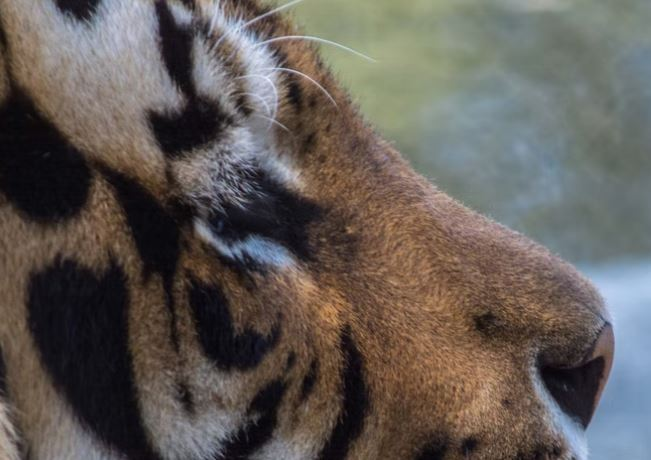
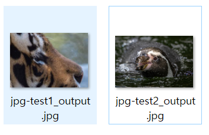

# Hash Collision

[Hash](#https://ko.wikipedia.org/wiki/%ED%95%B4%EC%8B%9C_%ED%95%A8%EC%88%98)는 임의의 길이의 데이터를 고정된 길이로 매핑하는 함수에 의해 얻어지는 값으로 두 Hash값이 다르다면 원래 데이터도 달라야 한다.

또한, Hash값을 통해 원래 데이터를 계산적으로 찾는 것은 불가능하기 때문에 무결성 검증이나 비밀번호 암호화에 사용된다.

다만, 원래 데이터가 다르다면 두 Hash값은 다르다라는 역은 성립되지 않는다. 이를 해시 충돌(Hash Collision)이라 한다.

Hash(A) = Hash(B)라면 Hash(A+C) = Hash(B+C)가 성립되기 때문에 해시 충돌이 되는 값을 통해 서로 다른 파일들을 생성해 볼 수 있다.

# **INDEX**

**1. [MD5](#MD5)**

**2. [SHA1](#SHA1)**

# **MD5**

다음의 스크립트는 서로 다른 png 혹은 jpeg파일을 합쳐 MD5 hash값이 같은 파일을 2개 생성한다.

```py
import hashlib
import binascii
import struct
import os
import argparse

# https://github.com/corkami/collisions

PREFIX  = {
    'JPEG' : [
        'FFD8FFFE0003AAFFFE0077BB82C3A6DCD80BEBA4B3FBF222DE0148F7851F2F6352DFEF069A4576188BFDEA251357834FB6236DFD509BF22D2FB7D4FE85DA23E3ABB7309CBC5B684C612528492E18B46D5622A2B583ABC4970EFC0FBD68DCE6A0149D32399B6E4E17B95735186FCEC540B90455771372F9AF787D44982753173B',
        'FFD8FFFE0003AAFFFE0177BB82C3A6DCD80BEBA4B3FBF222DE0148F7851F2F6352DFEF069A4576188BFDEA251357834FB6236DFD509BF22D2FB7D4FE85DA23E3ABB7309CBC5B684C612428492E18B46D5622A2B583ABC4970EFC0FBD68DCE6A0149D32399B6E4E17B95735186FCEC540B90455771372F9AF787D44982753173B'
    ],
    'PNG' : [
        '89504E470D0A1A0A00000033614C49474D4435206973202A7265616C6C792A1C64656164206E6F772021212121212120636F6C6C6973696F6E20626C6F636B733D3D3E2A72086100000071634F4C4C21F79E6511188BC7A960BC2E3E299CD32620F01B3DCFA756B49BB54DF7F19CF258D1690753D009FBEA349D9BA2957256DA708E66679492C42F80F23B73EED341ACAD1907729E7B8897E508344E7C779D302CC78D39A4BDF42B295A771967642D51BD5DC18578752CBC35D6176E6C16418C',
        '89504E470D0A1A0A00000033614C49474D4435206973202A7265616C6C792A1C64656164206E6F772021212121212120636F6C6C6973696F6E20626C6F636B733D3D3E2A72086100000171634F4C4C21F79E6511188BC7A960BC2E3E299CD32620F01B3DCFA756B49BB54DF7F19CF258D1690753D009FBEA349D9BA2957256DA708E66679492C42F80F13B73EED341ACAD1907729E7B8897E508344E7C779D302CC78D39A4BDF42B295A771967642D51BD5DC18578752CBC35D6176E6C16418C'
    ]
}

MD5HashCalculator = lambda data:(hashlib.md5(data).hexdigest())
HexStringToBytes  = lambda data:(binascii.unhexlify(data))
BaseDirectory     = 'Output'

def CreatePNG(Input1, Input2):
    OutputDirectory = os.path.join(BaseDirectory, 'PNG')
    _CRC32          = lambda d:(binascii.crc32(d) % 0x100000000)
    Prefix1         = HexStringToBytes(PREFIX['PNG'][0])
    Prefix2         = HexStringToBytes(PREFIX['PNG'][1])
    Dummy           = b"a"*(0x100 - 3*4)
    with open(Input1, "rb") as fp: d1 = fp.read()
    with open(Input2, "rb") as fp: d2 = fp.read()
    SkipLength  = 0x100 - 4*2 + len(d2[8:])

    Suffix          = struct.pack(">I", _CRC32(Prefix1[0x4b:0xc0]))
    Suffix          += b"".join([struct.pack(">I", SkipLength), b"sKIP", Dummy, b"\xDE\xAD\xBE\xEF", d2[8:], b"\x5E\xAF\x00\x0D",d1[8:]])
    Input1          = os.path.split(Input1)[-1]
    Input2          = os.path.split(Input2)[-1]
    Output1         = os.path.join(OutputDirectory, os.path.splitext(Input1)[0] + "_output" + os.path.splitext(Input1)[1])
    Output2         = os.path.join(OutputDirectory, os.path.splitext(Input2)[0] + "_output" + os.path.splitext(Input2)[1])
    OutputData1     = b"".join([Prefix1, Suffix])
    OutputData2     = b"".join([Prefix2, Suffix])
    MD5OutputData1  = MD5HashCalculator(OutputData1)
    MD5OutputData2  = MD5HashCalculator(OutputData2)

    if MD5OutputData1 != MD5OutputData2:
        print("[-] MD5 Collision Failed")
    else:
        os.makedirs(OutputDirectory, exist_ok=True)
        with open(Output1, "wb") as f: f.write(OutputData1)
        with open(Output2, "wb") as f: f.write(OutputData2)
        print('[+] Create Success')

    print('    - {} : {}'.format(Output1, MD5OutputData1))
    print('    - {} : {}'.format(Output2, MD5OutputData2))
    return

def CreateJPEG(Input1, Input2):
    OutputDirectory = os.path.join(BaseDirectory, 'JPEG')
    CommentStart    = lambda size:(b"\xff\xfe" + struct.pack(">H", size))
    Comment         = lambda size, s:(CommentStart(size) + s + b"\0" * (size - 2 - len(s)))
    Comments        = lambda s:(Comment(len(s) + 2, s))
    Prefix1         = HexStringToBytes(PREFIX['JPEG'][0])
    Prefix2         = HexStringToBytes(PREFIX['JPEG'][1])
    with open(Input1, "rb") as fp: d1 = fp.read()
    with open(Input2, "rb") as fp: d2 = fp.read()
    c1  = d1[2:].split(b"\xff\xda")

    if max(len(i) for i in c1) >= (65536 - 8):
        print("[-] The first image file has a segment that is too big! Maybe save it as progressive or reduce its size/scans.")
        return

    Suffix          = b"".join([b"\xff\xfe", struct.pack(">H", len(c1[0]) + 2 + 4), c1[0], b"".join([b"".join([Comments(b"\xff\xfe" + struct.pack(">H", len(c) + 4 + 4)), b"\xff\xda", c]) for c in c1[1:]]), b"\x00\x00\x00\x00", d2[2:]])
    Input1          = os.path.split(Input1)[-1]
    Input2          = os.path.split(Input2)[-1]
    Output1         = os.path.join(OutputDirectory, os.path.splitext(Input1)[0] + "_output" + os.path.splitext(Input1)[1])
    Output2         = os.path.join(OutputDirectory, os.path.splitext(Input2)[0] + "_output" + os.path.splitext(Input2)[1])
    OutputData1     = b"".join([Prefix2, Suffix])
    OutputData2     = b"".join([Prefix1, Suffix])
    MD5OutputData1  = MD5HashCalculator(OutputData1)
    MD5OutputData2  = MD5HashCalculator(OutputData2)

    if MD5OutputData1 != MD5OutputData2:
        print("[-] MD5 Collision Failed")
    else:
        os.makedirs(OutputDirectory, exist_ok=True)
        with open(Output1, "wb") as f: f.write(OutputData1)
        with open(Output2, "wb") as f: f.write(OutputData2)
        print('[+] Create Success')

    print('    - {} : {}'.format(Output1, MD5OutputData1))
    print('    - {} : {}'.format(Output2, MD5OutputData2))
    return

if __name__ == '__main__':
    parser  = argparse.ArgumentParser(description='MD5 충돌 파일 생성기')
    parser.add_argument('--type', '-t', dest='type', type=str, help='파일 타입', action="store", required=True, choices=['png', 'jpg'])
    parser.add_argument('--input', '-i', dest='input', type=str, help='입력 파일', action="store", nargs=2, required=True)
    args  = parser.parse_args()

    if args.type == 'jpg': CreateJPEG(args.input[0], args.input[1])
    elif args.type == 'png': CreatePNG(args.input[0], args.input[1])
```

다음의 두 이미지로 테스트 해보자.

| Name          | MD5 Hash                          | Image |
| :---:         | :---:                             | :---: |
| jpg-test1.jpg | c7ad51425b0cc9dc7d84b6df8d61a464  |    |
| jpg-test2.jpg | 5c38f07d1d2872b819a91fe889792b12  |    |

스크립트를 실행시키면 스크립트 폴더 위치에 Output이라는 디렉토리가 생기고 MD5 Hash가 같은 이미지가 생성된다.



해당 이미지를 [MD5 File Checksum](#https://emn178.github.io/online-tools/md5_checksum.html)에서 검증해보자.

# **SHA1**

다음의 스크립트 내 서로다른 hex값은 같은 SHA1 hash값을 갖는다.

```py
import hashlib
import binascii

HashCalc = lambda x:(hashlib.sha1(x).hexdigest())
HStr2Byte= lambda x:(binascii.unhexlify(x))


print(HashCalc(HStr2Byte('99040D047FE81780012000FF4B65792069732070617274206F66206120636F6C6C6973696F6E212049742773206120747261702179C61AF0AFCC054515D9274E7307624B1DC7FB23988BB8DE8B575DBA7B9EAB31C1674B6D974378A827732FF5851C76A2E60772B5A47CE1EAC40BB993C12D8C70E24A4F8D5FCDEDC1B32C9CF19E31AF2429759D42E4DFDB31719F587623EE552939B6DCDC459FCA53553B70F87EDE30A247EA3AF6C759A2F20B320D760DB64FF479084FD3CCB3CDD48362D96A9C430617CAFF6C36C637E53FDE28417F626FEC54ED7943A46E5F5730F2BB38FB1DF6E0090010D00E24AD78BF92641993608E8D158A789F34C46FE1E6027F35A4CBFB827076C50ECA0E8B7CCA69BB2C2B790259F9BF9570DD8D4437A3115FAFF7C3CAC09AD25266055C27104755178EAEFF825A2CAA2ACFB5DE64CE7641DC59A541A9FC9C756756E2E23DC713C8C24C9790AA6B0E38A7F55F14452A1CA2850DDD9562FD9A18AD42496AA97008F74672F68EF461EB88B09933D626B4F918749CC027FDDD6C425FC4216835D0134D15285BAB2CB784A4F7CBB4FB514D4BF0F6237CF00A9E9F132B9A066E6FD17F6C42987478586FF651AF96747FB426B9872B9A88E4063F59BB334CC00650F83A80C42751B71974D300FC2819A2E8F1E32C1B51CB18E6BFC4DB9BAEF675D4AAF5B1574A047F8F6DD2EC153A93412293974D928F88CED9363CFEF97CE2E742BF34C96B8EF3875676FEA5CCA8E5F7DEA0BAB2413D4DE00EE71EE01F162BDB6D1EAFD925E6AEBAAE6A354EF17CF205A404FBDB12FC454D41FDD95CF2459664A2AD032D1DA60A73264075D7F1E0D6C1403AE7A0D861DF3FE5707188DD5E07D1589B9F8B6630553F8FC352B3E0C27DA80BDDBA4C64020D')))
print(HashCalc(HStr2Byte('99030D047FE81780011800FF50726163746963616C205348412D312063686F73656E2D70726566697820636F6C6C6973696F6E211D276C6BA661E1040E1F7D767F076249DDC7FB332C8BB8C2B7575DBEC79EAB2BE1674B7DB34378B4CB732FE1891C76A0260772A5107CE1F6E80BB9977D2D8C68524A4F9D5FCDEDCD0B2C9CE19231AF26E9759D5250DFDB2D4D9F58729FEE553319B6DCCC619FCA4FB93B70EC72DE30A087EA3AE67359A2EE27320D72B1B64FECC9084FC3CCB3CDD83B62D97A904306150AFF6C267237E523E228417BDE6FEC4ECD7943B44A5F572C1EBB38EF11F6E00BC010D01E90AD78A3BE641997DC8E8D0D3A789F24C46FE1EABA7F35B4C7FB8272B6C50EDABA8B7CD655BB2C2FC50259E39F9570CDA94437BFFD5FAFE3CFCAC09812526615E827105B79178EAA43825A341A2ACFA5DE64CE7AF9DC59B54DA9FC9EB56756F2563DC70FF4C24C932CAA6B1418A7F54F30452A004E850DC99962FD98D8AD4259DEA97014DB4672F232F461F338B09923D626B4F5A0749CD02BFDDD6E825FC431DC35D00F7115285F172CB79E84F7CBA4DF514D571CF62368FC0A9E9DD32B9A16DA6FD16340429870C4586FEEE1AF96647FB426B53F2B9A98E8063F5B7B334CD0B250F826BCC427550B1974C920FC280986E8F1FFC01B51DF14E6BFC61B9BAEE6C1D4AAE99D574A00C38F6DCA5C153A834122939BF5928F98C2D9363E3EF97CF25342BF28F56B8EF73B5676E485CCA8F5D3DEA0A65E413D59EC0EE71C201F163B6F6D1EB3F525E6AA06AE6A2DFEF17CE205A404F76312FC554141FDDB9CF24586D0A2AD1F111DA60ECF26406FF7F1E0C6E5403AFB4CD861CB33E5707348DD5E1765589B83A7663051838FC34A03E0C26DA80BDDB6F464021D')))
```

또 다른 SHA1 Collision은 [shattered](https://shattered.io/)에 PDF 예제로 나와 있으며, [SHA1 Collider](http://alf.nu/SHA1)에서는 서로 다른 JPG파일을 같은 SHA1 Hash 값을 같은 PDF로 변환해주는 예제가 있다.