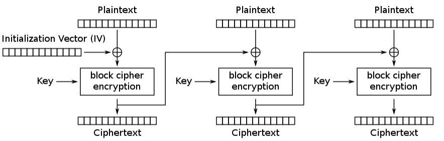
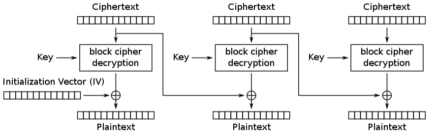
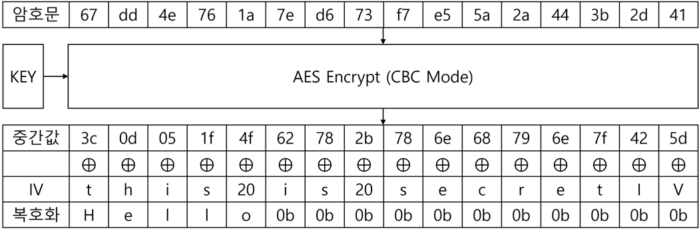
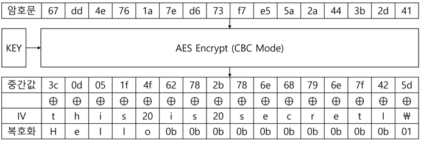
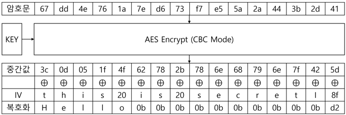

# Padding Oracle Attack

패딩의 올바름을 검증하는 시스템에서 암호문의 원본 데이터를 구할 수 있는 공격

# **INDEX**

**1. [환경 구성](#환경-구성)**

**2. [공격 방법](#공격-방법)**

**3. [평문 구하기](#평문-구하기)**

# **환경 구성**

| Type          | Version                   |
| :---          | :---                      |
| OS            | Windows 21H1              |
| Architecture  | x86-64                    |
| python3       | 3.6.10                    |
| flask         | 1.1.2                     |
| pycryptodomex | 3.10.1                    |
| requests      | 2.24.0                    |
| json          | 2.0.9                     |

IV와 암호문을 통해 복호화해주는 서버를 구축한다.

```py
from flask import Flask, abort, jsonify, request
from Cryptodome.Cipher import AES
from Cryptodome.Util import Padding
from binascii import unhexlify
from logging import getLogger
from secrets import token_bytes, token_hex

app         = Flask(__name__)
app.debug   = False
app.logger  = getLogger('werkzeug')
app.logger.disabled = True

FLAG            = 'garbage!'*2 + 'FLAG{'+token_hex(32)+'}'
print(FLAG[AES.block_size:])
AESKey          = token_bytes(16)
AESIV           = token_bytes(16)
PaddedFLAG      = Padding.pad(data_to_pad=FLAG.encode(), block_size=AES.block_size)
EncryptedMessage= AES.new(AESKey, AES.MODE_CBC, AESIV).encrypt(PaddedFLAG)

@app.route('/')
def index():
    ResponseData = { 'Message' : EncryptedMessage.hex() }
    return jsonify(ResponseData), 200

@app.route('/decrypt/', methods=['POST'])
def decrypt():
    Parameter = request.get_json()
    try:
        Cipher                      = AES.new(AESKey, AES.MODE_CBC, unhexlify(Parameter['InitialVector']))
        JSONEncryptedMessage        = unhexlify(Parameter['Message'])
        DecryptedMessage            = Cipher.decrypt(JSONEncryptedMessage)
        UnPaddedDecryptedMessage    = Padding.unpad(padded_data=DecryptedMessage, block_size=AES.block_size)
        ResponseData = { 'Message' : UnPaddedDecryptedMessage.hex() }
        return jsonify(ResponseData), 200
    except ValueError: abort(500)

@app.errorhandler(404)
def errorhandler404(error): return jsonify({ 'Message' : '404 Not Found', 'InitialVector' : '' }), 404

@app.errorhandler(500)
def errorhandler404(error): return jsonify({ 'Message' : '500 Internal Server Error', 'InitialVector' : '' }), 500

if __name__=='__main__':
    app.run(host='0.0.0.0', port=5000)
```


# **공격 방법**

블록 암호화의 [CBC 모드](#https://en.wikipedia.org/wiki/Block_cipher_mode_of_operation#Cipher_block_chaining_(CBC))는 다음과 같이 동작한다.

| Type      | Algorithm |
| :---:     | :---:     |
| Encrypt   |  |
| Decrypt   |  |

복호화가 진행되었을 때, 3가지의 경우로 나뉘어 볼 수 있다.

1. 복호화의 결과가 평문가 같음
2. 복호화의 결과가 평문과 다름
3. 패딩 오류

Hello를 암호화하였다는 가정하에 3가지 경우를 살펴본다.

| Type      | Data  |
| :---:     | :---  |
| Key       | 74 68 69 73 20 69 73 20 73 65 63 72 65 74 21 21 (this is secret!!)    |
| IV        | 74 68 69 73 20 69 73 20 73 65 63 72 65 74 49 56 (this is secretIV)    |
| Plain Text| 48 65 6c 6c 6f (Hello)    |
| Padding   | PKCS#7        |
| Encrypt   | AES-128-CBC   |

1번의 경우는 암호화 시 사용했던 Initialization Vector를 사용한다면 다음과 같이 정상적으로 복호화가 된다.



2번의 경우는 복호화가 정상적으로 되었지만, 평문과 다른 값이 나온 경우이다.

이때, 복호화된 결과의 마지막 바이트가 0x01이 패딩으로 취급되어 마지막 0x0b까지 평문으로 인식되는 것이다.



3번의 경우는 복호화의 결과에서 패딩이 없는 경우이다.

키의 길이가 16byte이므로 암호화 블록 사이즈도 16byte이다.

만약 평문의 길이가 16byte였다면, 패딩은 0x10으로 16byte뒤에 추가가 되었을 것이다.



운이 좋다면 바로 1번 경우에 걸려 평문을 알아낼 수 있겠지만, 확률이 적으므로 2번과 3번의 경우를 이용하여 패딩 오라클 공격을 수행할 수 있다.

IV와 암호문을 전달하면 서버의 키를 통해 복호화를 시켜주는 시스템이 있고, Hello의 암호문을 알고 있다고 가정한다.

복호화 결과의 마지막 바이트가 0x01이 될동안 IV를 전달한다.

| Type      | Data  |
| :---:     | :---  |
| Encrypt   | 67 dd 4e 76 1a 7e d6 73 f7 e5 5a 2a 44 3b 2d 41   |
| IV        | 00 00 00 00 00 00 00 00 00 00 00 00 00 00 00 5c   |
| Decrypt   | 3c 0d 05 1f 4f 62 78 2b 78 6e 68 79 6e 7f 42 01   |

이때, 중간값의 마지막 바이트를 구하기 위해서는 0x01과 0x5c를 XOR 연산을 한다.

| Type      | Data  |
| :---:     | :---  |
| 중간값    | ?? ?? ?? ?? ?? ?? ?? ?? ?? ?? ?? ?? ?? ?? ?? 5d |

뒤에서 두번째를 구하기 위해서는 복호화의 결과가 0x02 0x02로 나와야 한다.

| Type      | Data  |
| :---:     | :---  |
| Encrypt   | 67 dd 4e 76 1a 7e d6 73 f7 e5 5a 2a 44 3b 2d 41   |
| IV        | 00 00 00 00 00 00 00 00 00 00 00 00 00 00 40 5f   |
| Decrypt   | 3c 0d 05 1f 4f 62 78 2b 78 6e 68 79 6e 7f 02 02   |

이제 중간값의 마지막에서부터 2번째 바이트를 구하기 위해서는 0x02와 0x40을 XOR 연산을 한다.

| Type      | Data  |
| :---:     | :---  |
| 중간값    | ?? ?? ?? ?? ?? ?? ?? ?? ?? ?? ?? ?? ?? ?? 42 5d |

이렇게 반복하여 복호화의 모든 결과가 패딩 값(0x10)이 될 때까지 반복하면 중간값을 구할 수 있다.

| Type      | Data  |
| :---:     | :---  |
| 중간값    | 3c 0d 05 1f 4f 62 78 2b 78 6e 68 79 6e 7f 42 5d |

그리고 이 값을 진짜 IV와 XOR하면 Hello World를 구할 수 있다.

암호화 시 사용한 IV를 모르고 암호문이 Key 및 IV길이와 같다면 구할 수 없지만, 암호문이 더 길다면 뒷부분은 평문으로 구할 수 있다. (CBC 복호화 알고리즘을 보면 알 수 있다.)

# **평문 구하기**

서버가 실행중이면 다음의 스크립트를 통해 평문(FLAG)의 일부를 구할 수 있다.

```py
from Cryptodome.Util import Padding
from binascii import unhexlify
import requests
import json
import sys

Response        = requests.get(url='http://127.0.0.1:5000/')
JSONObject      = json.loads(Response.text)
EncryptedMessage= unhexlify(JSONObject['Message'])

BLOCK_SIZE      = 16
DECRYPT_URL     = 'http://127.0.0.1:5000/decrypt/'
ATTACK_COUNT    = len(EncryptedMessage) // BLOCK_SIZE
MESSAGE_BLOCK   = [EncryptedMessage[i * BLOCK_SIZE : (i + 1) * BLOCK_SIZE] for i in range(ATTACK_COUNT)]
FLAG            = b''

for i in range(ATTACK_COUNT -1, 0, -1):
    INTERMEDIARY    = bytearray(BLOCK_SIZE)
    TEMP_BYTE_ARRAY = bytearray(BLOCK_SIZE)
    HIT_COUNT       = 0
    OLD_COUNT       = 0
    for x in range(1, BLOCK_SIZE + 1):
        OLD_COUNT   = HIT_COUNT
        for y in range(0x100):
            TEMP_BYTE_ARRAY[-x] = y

            JSON_DATA   = { 'InitialVector' : TEMP_BYTE_ARRAY.hex(), 'Message' : MESSAGE_BLOCK[i].hex() }
            RESPONSE    = requests.post(url=DECRYPT_URL, json=JSON_DATA)
            JSON_OBJECT = json.loads(RESPONSE.text)
            if RESPONSE.status_code == 200:
                UNPAD_DECRYPT_MESSAGE   = unhexlify(JSON_OBJECT['Message'])
                if BLOCK_SIZE - len(UNPAD_DECRYPT_MESSAGE) == x:
                    INTERMEDIARY[-x] = y ^ x
                    for z in range(x): TEMP_BYTE_ARRAY[-(z + 1)] = INTERMEDIARY[-(z + 1)] ^ (x + 1)
                    HIT_COUNT += 1
                    break
        if OLD_COUNT == HIT_COUNT:
            print('Oracle Padding Attack Failed...')
            sys.exit(-1)
    FLAG = bytes(x ^ y for (x, y) in zip(INTERMEDIARY, MESSAGE_BLOCK[i - 1])) + FLAG
print(Padding.unpad(padded_data=FLAG, block_size=BLOCK_SIZE).decode())
```