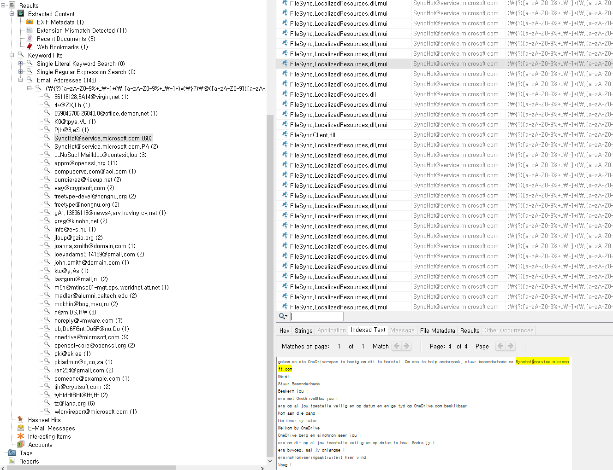

# AutoPsy

[Autopsy](#https://www.autopsy.com/download/)는 sleuth Kit을 Windows에서 GUI 형태로 이용할 수 있는 포렌식 도구

# **INDEX**

**1. [환경](#환경)**

**2. [Add Case](#Add-Case)**

**3. [File Recovery](#File-Recovery)**

# **환경 구성**

| Type          | Version                       |
| :---          | :---                          |
| OS            | Windows 1909 Build 18363.418  |
| Architecture  | x86-64                        |
| RAM           | 2GB                           |
| CPU           | 4Core                         |
| C:            | 30GB                          |
| E:            | 50GB                          |
| Autopsy       | 4.7.0                         |

# **Add Case**

Case가 없을 경우 New Case 버튼을 클릭한다.

Case 정보를 입력 후 Next 버튼을 클릭한다.

시험관 정보 등을 적고 Finish 버튼을 클릭한다.

Add Data Source 버튼을 클릭한다.

Disk Image or VM File을 선택 후 Next 버튼을 클릭한다.

디스크 이미지를 선택 후 Next 버튼을 클릭한다.

Next 버튼을 클릭한다.

이미지가 로드되었으면 Finish 버튼을 클릭한다.

우측 하단에 분석이 진행되고 있음을 확인할 수 있다.

좌측에서 FTK Imager와 같이 폴더로 계층적으로 볼 수 있다.

FTK Imager와 다르게 Autopsy에서는 파일의 타입, 삭제된 파일 등을 모아서 보여준다.

또 다른 필터링을 통해서 유용한 정보를 모아서 보여주며 미리보기도 지원된다.

# **File Recovery**

삭제된 파일만이 아니라 다른 파일도 우클릭하여 Extract File(s) 버튼을 클릭하여 저장장소를 선택 후 파일을 추출할 수 있다. 

드래그, Shift 클릭, Ctrl 클릭 등으로 다중 파일을 선택하여 추출도 가능하다.

