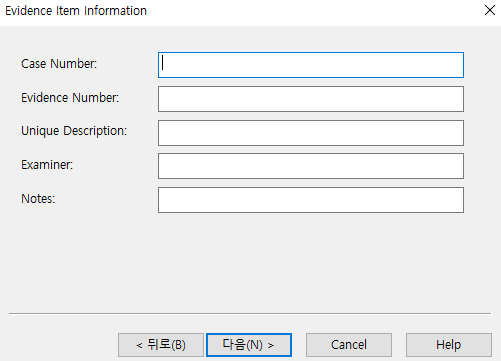

# FTK Imager

FTK Imager는 AccessData에서 제작한 디지털 포렌식 도구

# **INDEX**

**1. [환경](#환경)**

**2. [Disk Imaging](#Disk-Imaging)**

**3. [Add Evidence item](#Add-Evidence-item)**

 - [Physical Drive](#Physical-Drive)

 - [Image File](#Image-File)

**4. [Memory Dump](#Memory-Dump)**

**5. [File Recovery](#File-Recovery)**

# **환경**

| Type          | Version                       |
| :---          | :---                          |
| OS            | Windows 1909 Build 18363.418  |
| Architecture  | x86-64                        |
| RAM           | 2GB                           |
| CPU           | 1Core                         |
| C:            | 30GB                          |
| E:            | 50GB                          |
| FTK Imager    | 4.2.1.4                       |

# **Disk Imaging**

FTK Imager를 실행 후 Create Disk image 버튼을 클릭한다.

Physical Drive를 선택 후 다음 버튼을 클릭한다.

이미징할 디스크(C:)를 선택 후 Finish를 클릭한다.

이미지를 저장할 경로를 선택하기 위해 Add를 클릭한다.

생성할 이미지의 타입을 선택할 수 있다. Raw(dd) 혹은 E01을 선택하지만, 조금 더 압축된 포맷인 E01을 선택 후 다음 버튼을 클릭한다.

필요한 값을 넣은 후 다음을 클릭한다. 여기서는 모두 공란으로 다음을 클릭하였다.

이미지의 저장 경로를 설정하고 저장되는 파일 이름을 설정한다. Fragment Size의 경우 분할이 아닌 1개의 파일로 생성할 것이다.

설정을 하였으면 Finish 버튼을 클릭한다.

Start 버튼을 클릭하여 디스크 이미징을 하자.

18분 36초만에 작업이 모두 완료되었고 다음과 같은 화면이 출력되었다. 오류 여부를 확인한다.

# **Add Evidence item**

FTK Imager로 디스크를 분석하기 위해 디스크를 로드해야한다.

## **Physical Drive**

이미징된 디스크를 마운트하여 해본다. 마운트를 하는 이유는 기타 다른 도구를 통해서 디스크 경로를 잡아서 편하게 아티팩트들을 추출할 수 있기 때문이다.

FTK Imager를 실행 후 Image Mounting 버튼을 클릭한다.

이미지 파일을 선택 후 Mount 버튼을 클릭한다.

설치를 클릭한다.

마운트가 성공적으로 되었음을 확인할 수 있다.

Add Evidence item 버튼을 클릭한다.

이미지가 마운트되었기 때문에 Physical Drive를 선택 후 다음 버튼을 클릭한다.

마운트했을 나온 디스크 번호를 선택 후 Finish 버튼을 클릭한다.

Evidence Tree에 이미지가 로드되었다.

## **Image File**

Add Evidence item 버튼을 클릭한다.

디스크 이미징 파일을 가지고 있기 때문에 Image File을 선택 후 다음 버튼을 클릭한다.

이미지의 경로를 설정 후 Finish 버튼을 클릭한다.

Evidence Tree에 이미지가 로드되었다.

# **Memory Dump**

FTK Imager 상단에 Capture Memory 버튼을 클릭한다.

메모리 덤프 파일의 저장 경로와 파일 이름을 설정 후 Capture Memory 버튼을 클릭한다.

성공적으로 덤프가 되었다면 Successfully가 출력된다.

# **File Recovery**

삭제될 파일을 복구하기 위해서는 파일이 삭제된 디스크가 로드되어야 한다.

따라서 바탕화면에 임의의 데이터를 쓴 텍스트 파일 하나를 만들어보자.

이후 텍스트 파일을 shift + delete를 통해서 완전 삭제하면 휴지통에도 들어가지 않는다.

FTK Imager에서 삭제한 파일의 디스크를 로드한다. 여기에서는 Physical Drive0에서 파일을 삭제했다.

Physical Drive0를 Evidence에 추가 후 바탕화면까지 온다면 텍스트 파일 아이콘에 X가 표시되어 있고, 삭제된 파일이라는 뜻이다.

수정시간은 UTC기준이라 KST로 맞추려면 +9시간을 해야한다.

파일을 복구해보기 위해 삭제된 파일을 우클릭 하여 Export Files를 클릭한다.

이후 복구될 파일의 저장경로를 지정하면 파일을 복구한다.

삭제되었어도 해당 영역에 데이터가 덮어씌워지지 않는다면 이와 같이 파일을 복구할 수 있다.

