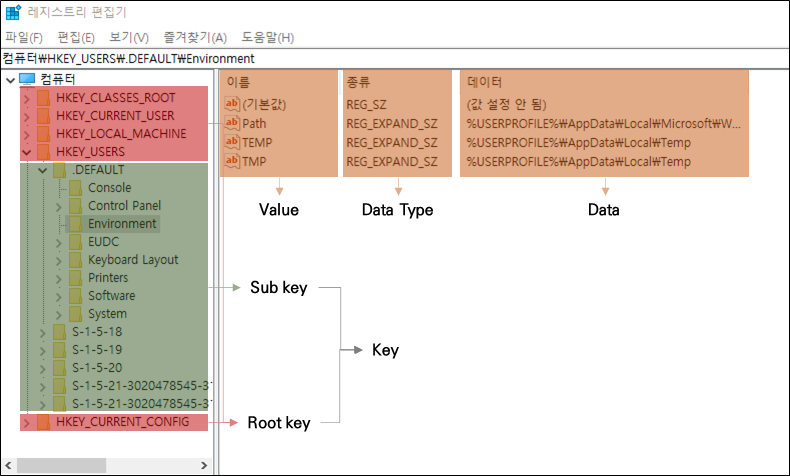
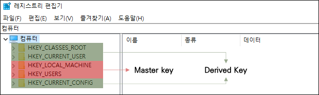

# **레지스트리**

윈도우 운영체제와 응용 프로그램 운영에 필요한 정보를 담고 있는 계층형 데이터베이스

## **레지스트리 구성**

레지스트리는 다음과 같이 루트 키와 하위 키로 계층적으로 이루어져 있으며, 키는 값과 데이터 타입, 데이터로 구성되어 있다.

| Root key              | 약어  | 설명  |
| :---                  | :---  | :---  |
| HKEY_CLASSES_ROOT     | HKCR  | 파일 확장자 연결 정보, [COM](https://ko.wikipedia.org/wiki/%EC%BB%B4%ED%8F%AC%EB%84%8C%ED%8A%B8_%EC%98%A4%EB%B8%8C%EC%A0%9D%ED%8A%B8_%EB%AA%A8%EB%8D%B8) 객체 등록 정보            |
| HKEY_CURRENT_USER     | HKCU  | 현재 시스템에 로그인된 사용자의 프로파일 정보         |
| HKEY_LOCAL_MACHINE    | HKLM  | 시스템의 하드웨어, 소프트웨어 설정 및 기타 환경 정보  |
| HKEY_USERS            | HKU   | 시스템의 모든 사용자와 그룹에 관한 프로파일 정보      |
| HKEY_CURRENT_CONFIG   | HKCC  | 시스템이 시작할 때 사용되는 하드웨어 프로파일 정보    |

Root key는 다음과 같이 HKLM과 HKU로 구성된 Mater key와 HKCR, HKCU, HKCC로 구성된 Derived key로 구분할 수 있다.

Derived Key는 Master key의 하위 키들의 데이터를 모아 놓은 키이다.

| Key   | 설명  |
| :---  | :---  |
| HKCR  | HKLM\SOFTWARE\Classes, HKU\\{SID}_Classes의 하위키 모음 |
| HKCU  | HKU의 사용자 프로파일 중 로인한 사용자의 하위키 모음 |
| HKCC  | HKLM\SYSTEM\CurrentControlSet\Hardware Profiles\Current의 하위키 모음 |