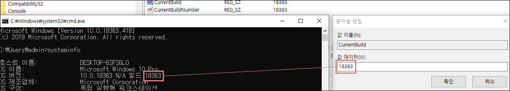
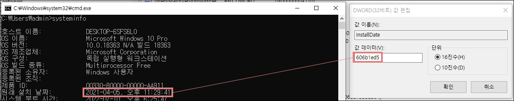
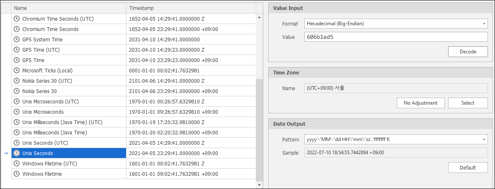
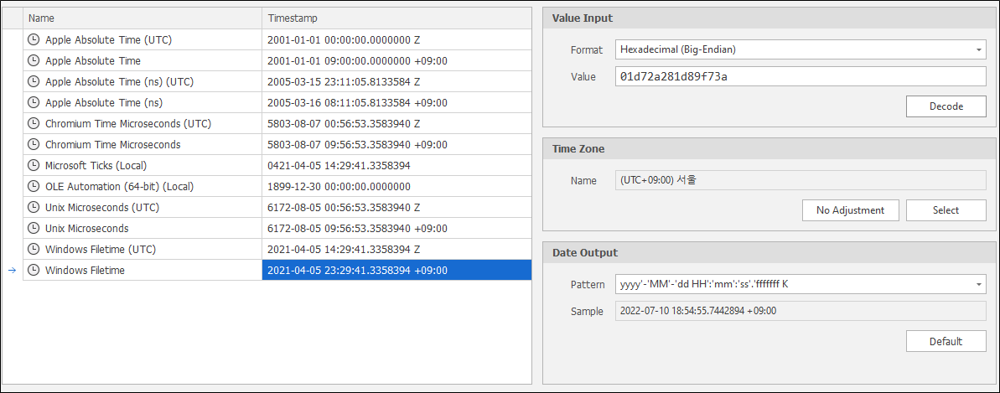
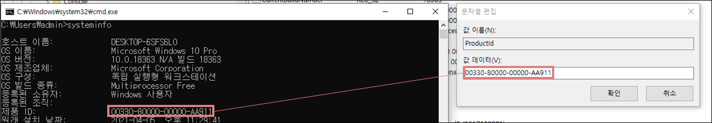
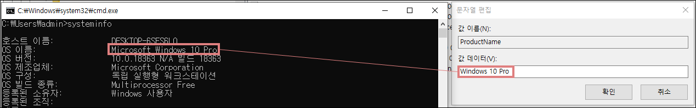
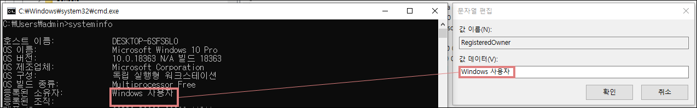
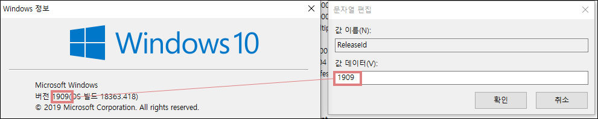
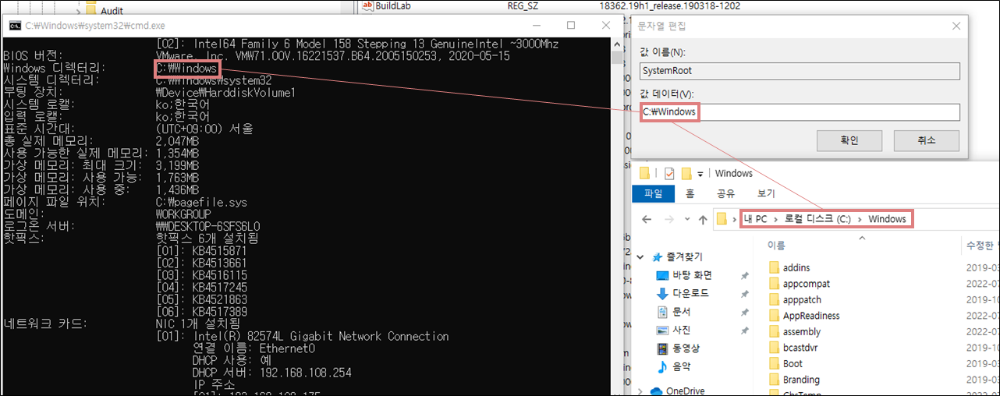

# 시스템 정보

경로 : HKLM\SOFTWARE\Microsoft\Windows NT\CurrentVersion

| 값                                        | 설명  |
| :---                                      | :---  |
| CurrentBuild CurrentBuildNumber        | 운영체제 세부 버전 |
| InstallDate InstallTime                | 운영체제 설치 시간 |
| ProductId                                 | 운영체제 식별자 |
| ProductName                               | 운영체제 이름 |
| RegisteredOrganization RegisteredOwner | 조직 이름 사용자 이름 |
| ReleaseId                                 | 운영체제 버전 |
| SystemRoot                                | 운영체제 설치 경로 |

## **CurrentBuild(Number)**

운영체제의 세부 버전을 나타낸다.

## **InstallDate/InstallTime**

운영체제의 설치 시간을 나타낸다.

데이터는 Unix 시간 형식을 가지고 있으며 DCode로 변환하여 운영 체제의 설치 시간을 확인할 수 있다.

InstallTime도 마찬가지로 DCode를 이용하여 시간을 구할 수 있다.

## **ProductId**

제품 ID를 나타낸다.

## **ProductName**

운영체제 이름을 나타낸다.

## **RegisteredOrganization/RegisteredOwner**

등록된 조직과 사용자를 나타낸다.

## **ReleaseId**

운영체제 버전을 나타낸다.

## **SystemRoot**

운영체제 경로를 나타낸다.

