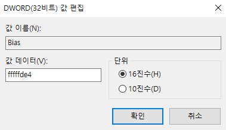
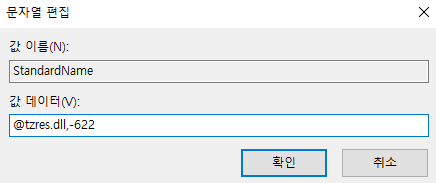
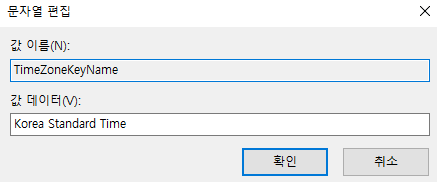

# 시스템 시간 정보

경로 : HKLM\SYSTEM\CurrentControlSet\Control\TimeZoneInformation

| 값                | 설명  |
| :---              | :---  |
| Bias              | UTC와의 시간 차이 |
| StandardName      | 표준 시간대의 표준 시간을 나타내는 이름 |
| TimeZoneKeyName   | 표준 시간대의 이름 |

## **Bias**

데이터를 살펴보면 0xfffffde4 (4294966756)로 나와있다.

bias의 데이터는 unsigned로 나타나 있지만, [integer encoder](https://cryptii.com/pipes/integer-encoder)에서 big endian에 I32로 변환하면 -540이 나온다.

혹은 -(0xffffffff + 1 -0xfffffde4)으로 연산하여 -540값을 얻을 수 있다.

-540은 분을 표기한것으로 시간대가 UTC + 9시간임을 알 수 있다.

## **StandardName**

데이터를 살펴보면 @tzres.dll, -622로 나와있다.

[tzres.dll](https://windows10dll.nirsoft.net/tzres_dll.html)에서 622라는 String ID를 살펴보면 Korea Standard Time임을 알 수 있고, Bias와 일치한다.

## **TimeZoneKeyName**

데이터를 살펴보면 Korea Standard Time로 나와있다.

이는 Bias과 일치하는 시간대이다.