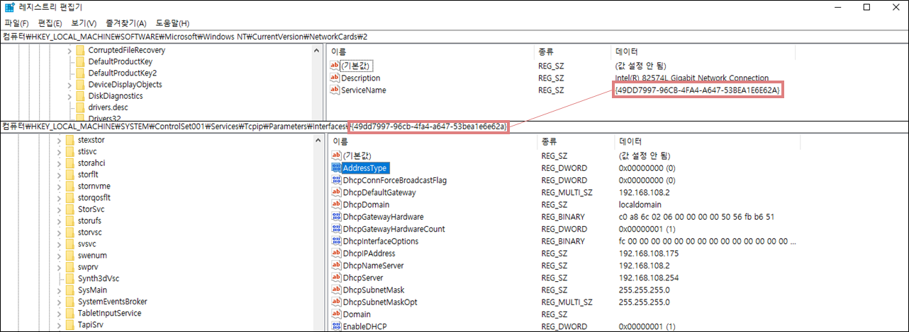

# 네트워크 정보

## **인터페이스 GUID**

경로 : HKLM\SOFTWARE\Microsoft\Windows NT\CurrentVersion\NetworkCards

하위 키에 네트워크 인터페이스들의 정보가 담긴 키가 존재하며, ServiceName의 데이터에 GUID가 존재한다.

## **인터페이스 정보**

경로 : HKLM\SYSTEM\ControlSet001\Services\Tcpip\Parameters\Interfaces\\{GUID}

DHCP 방식일 때 DhcpIPAddress에 IP 주소가 있으며, Static일 때는 IPAddress라는 값에 주소가 있다.

