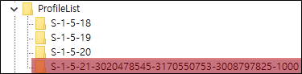
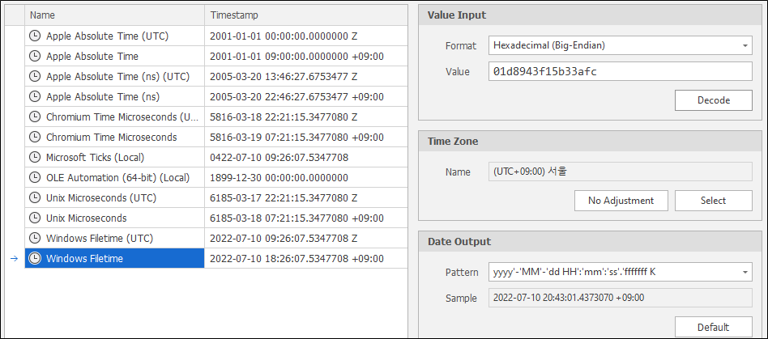
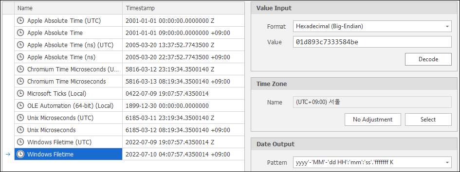

# 사용자 계정 정보

경로 : HKLM\SOFTWARE\Microsoft\Windows NT\CurrentVersion\ProfileList

ProfileList는 다음과 같이 하위 여러 키가 존재한다.

| 서브 키       | 설명  |
| :---          | :---  |
| S-1-5-18      | systemprofile     |
| S-1-5-19      | LocalService      |
| S-1-5-20      | NetworkService    |
| S-1-5-21      | 사용자 계정 (SID) |

## **SID (Security Identifier)**

다음과 같은 사용자 계정을 통해 설명해본다.

| SID 구분                          | 설명 |
| :---                              | :--- |
| S                                 | SID임을 나타내는 식별자   |
| 1                                 | SID 세부 버전 |
| 5                                 | 권한 식별자 0 : Null 1 : World 2 : Local 3 : Creator 4 : Non-unique 5 : NT 9 : Resource Manager   |
| 3020478545-3170550753-3008797825  | 도메인이나 로컬 컴퓨터 식별자 |
| 1000                              | RID (Relative ID) 500 : 관리자 계정 1xxx : 사용자 계정 |

## **마지막 로그인 시간**

사용자 SID 키의 LocalProfileLoadTimeHigh 값과 LocalProfileLoadTimeLow 값을 통해서 사용자의 마지막 로그인 시간을 알 수 있다.

LocalProfileLoadTimeHigh가 0x1d8943f이고 LocalProfileLoadTimeLow가 0x15b33afc라면 0x1d8943f15b33afc로 값을 알아내면 된다.

## **마지막 로그아웃 시간**

로그인과 마찬가지로 LocalProfileUnLoadTimeHigh 값과 LocalProfileUnLoadTimeLow 값을 통해서 사용자의 마지막 로그아웃 시간을 알 수 있다.

## **마지막 로그인 사용자**

경로 : HKLM\SOFTWARE\Microsoft\Windows NT\CurrentVersion\Winlogon

| 값                | 설명  |
| :---              | :---  |
| AutoAdminLogon    | 자동 로그인 설정 1 : 활성화 (DefaultUserName과 DefaultPassword가 설정되어 있는 경우) 0 : 비활성화 |
| AutoLogonSID      | 자동 로그인 시 사용자의 SID |
| LastUsedUsername  | 마지막으로 로그인한 사용자 |