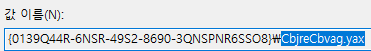
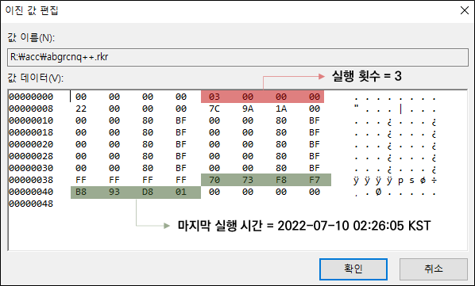

# 응용 프로그램 정보

## **설치된 프로그램 목록**

경로 : HKLM\SOFTWARE\Microsoft\Windows\CurrentVersion\Uninstall

## **프로그램의 실행 정보**

경로 : HKCU\SOFTWARE\Microsoft\Windows\CurrentVersion\Explorer\UserAssist

실행한 프로그램 목록, 마지막 실행 시간, 실행 횟수가 기록된다.

그 중 다음의 하위키들을 살펴본다.

| OS    | Key   | 설명  |
| :---  | :---  | :---  |
| ​Windows 2000 Windows XP Windows Vista Windows Server 2003   | {5E6AB780-7743-11CF-A12B-00AA004AE837}\Count {75048700-EF1F-11D0-9888-006097DEACF9}\Count  | 실행파일의 실행기록 바로가기의 실행 기록   |
| Windows 7 Windows 8 Windows 10 Windows 11    | {CEBFF5CD-ACE2-4F4F-9178-9926F41749EA}\Count {F4E57C4B-2036-45F0-A9AB-443BCFE33D9F}\Count  | 실행파일의 실행기록 바로가기의 실행 기록   |

값들은 [ROT13](https://ko.wikipedia.org/wiki/ROT13)으로 인코딩되어 있기 때문에 ROT13으로 디코딩하여 읽을 수 있다.

데이터에서 0x04 ~ 0x07 offset까지는 실행한 횟수이며 0x3C ~ 0x43 offset까지는 마지막 실행 시간을 나타낸다.

