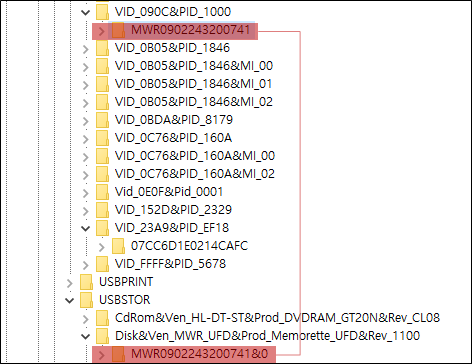

# USB 연결 정보

## **USB 인식 과정**

1. 버스 드라이버는 Plug & Play Manager에게 고유 식별정보를 전송하며 이벤트를 알림
2. Plug & Play Manager는 받은 정보를 기반으로 Device Class ID를 설정 후 드라이버 검색
3. 드라이버가 없을 경우 USB 펌웨어로부터 드라이버를 전달받아 기록

    HKLM\SYSTEM\ControlSet001\Enum\USBSTOR\\{DID}

    HKLM\SYSTEM\CurrentControlSet\Control\DeviceClasses\\{GUID}

4. 드라이버 설치 과정을 로그에 기록 : %SystemRoot%\INF\Setupapi.dev.log

## **USB 정보 확인**

경로 : HKLM\SYSTEM\ControlSet001\Enum\USBSTOR

하위 키들은 장치 클래스 ID(Device Class Indentifier)로 구성된다.

    Disk&Ven_{제조사}&Prod_{제품명}&Rev_{버전}

장치 클래스 ID의 하위 키는 해당 장치의 Serial number로 구성된다.

    {Serial Number}&#

Serial Number가 존재하지 않는 경우 Plug & Play Manager에 의해 임의의 번호가 다음과 같이 부여된다.
    
    #${Random Number}$#

## **제조사와 제품 ID 확인**

경로 : HKLM\SYSTEM\ControlSet001\Enum\USB

하위 키들은 제조사의 ID와 제품 ID로 구성된다.

    VID_{제조사 ID}&PID_{제품 ID}

[제소사 ID와 제품 ID 검색](#https://devicehunt.com/view/type/usb/vendor/090C/device/1000)을 통해 제조사와 제품을 알아 볼 수 있다.

USB와 USBTOR는 연관성이 있다.

## **드라이브 문자**

경로 : HKLM\SOFTWARE\Microsoft\Windows Search\VolumeInfoCache

경로 : HKLM\SYSTEM\MountedDevices