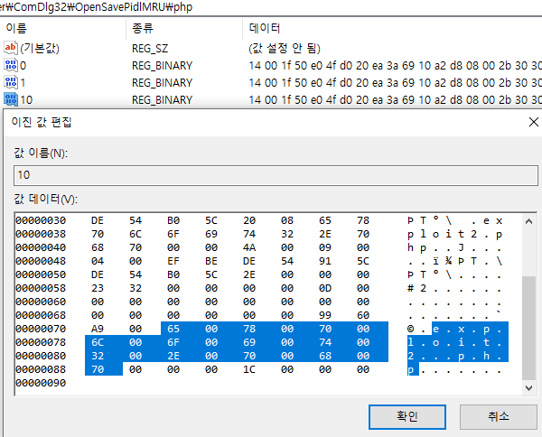
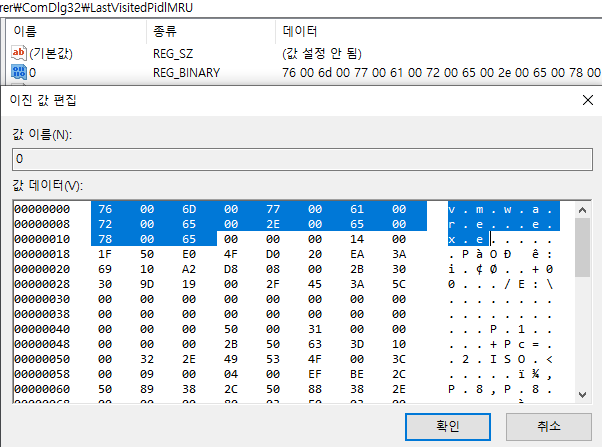
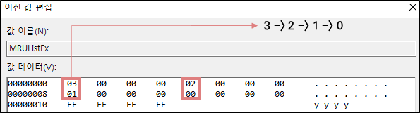
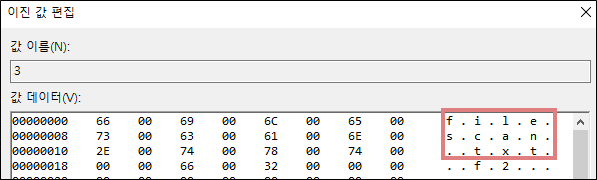
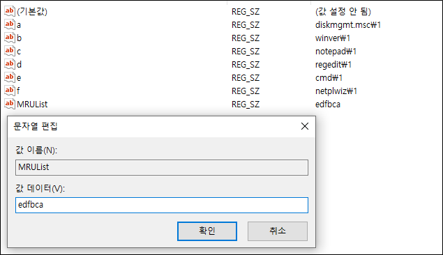

# 최근 사용 기록 정보

## **최근 열람 파일 정보**

경로 : HKCU\SOFTWARE\Microsoft\Windows\CurrentVersion\Explorer\ComDlg32\OpenSavePidlMRU

경로 : HKCU\SOFTWARE\Microsoft\Windows\CurrentVersion\Explorer\ComDlg32\LastVisitedPidlMRU

열기 혹은 저장 기능으로 사용된 파일들을 확장자 별로 모아져있으며, 어떤 파일이 열렸는지 확인이 가능하다.

## **최근 열람 문서 정보**

경로 : HKCU\SOFTWARE\Microsoft\Windows\CurrentVersion\Explorer\RecentDocs

확장자 별로 하위 키들이 구성되어 있으며 MRUListEx에서 열어본 순서의 정보가 있다.

해당 숫자를 가지는 값의 데이터를 보면 파일 명을 알 수 있다.

## **최근 명령 실행 정보**

경로 : HKCU\SOFTWARE\Microsoft\Windows\CurrentVersion\Explorer\RunMRU

MRUList에 입력한 순서가 표시되며 알파벳을 가지는 값의 데이터에는 입력한 데이터가 있다.

## **최근 접근 폴더 정보**

사용자가 접근한 폴더 정보를 가지고 있으면 경로는 다음과 같다.

    HKCU\SOFTWARE\Classes\Local Settings\Software\Microsoft\Windows\Shell\Bags
    HKCU\SOFTWARE\Classes\Local Settings\Software\Microsoft\Windows\Shell\BagMRU
    HKCU\SOFTWARE\Microsoft\Windows\Shell\Bags
    HKCU\SOFTWARE\Microsoft\Windows\Shell\BagMRU

BagMRU는 폴더의 구조를 계층적 구조로 나타내며 Bags은 윈도우 사이즈, 위치 등 사용자의 환경설정을 저장한다.