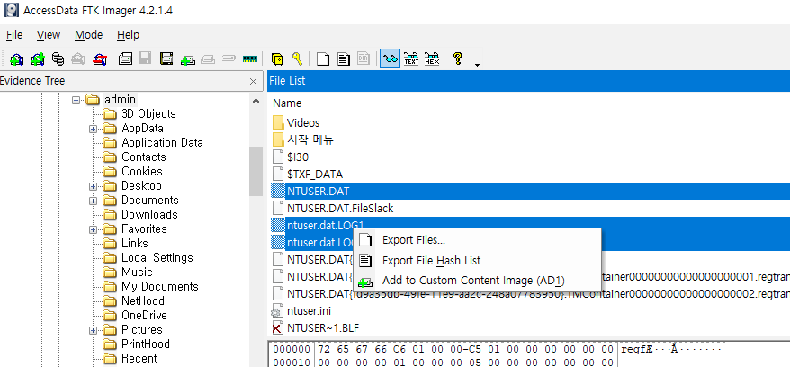

# **레지스트리 수집**

FTK Imager를 이용하여 다음의 파일을 추출한다.

    %SystemRoot%\Users\{사용자 이름}\NTUSER.DAT
    %SystemRoot%\System32\config\DEFAULT
    %SystemRoot%\System32\config\SAM
    %SystemRoot%\System32\config\SECURITY
    %SystemRoot%\System32\config\SOFTWARE
    %SystemRoot%\System32\config\SYSTEM

파일 추출 시 .LOG1과 .LOG2를 함께 추출한다.

