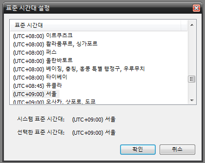
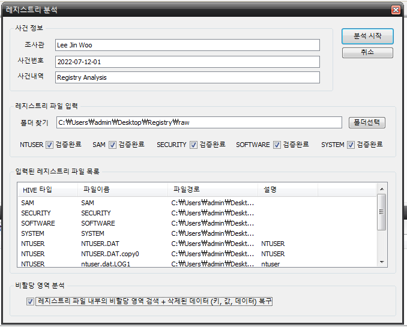
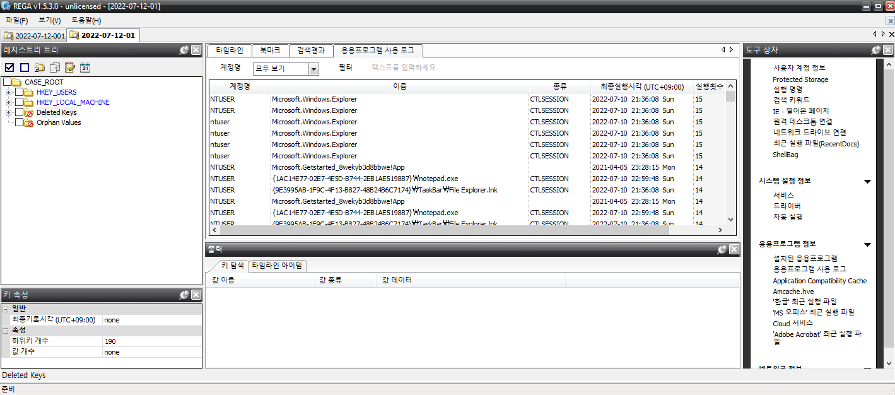
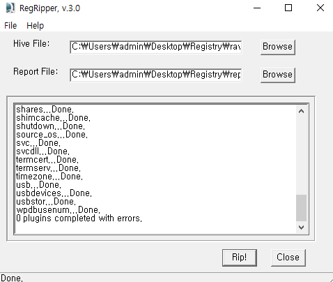
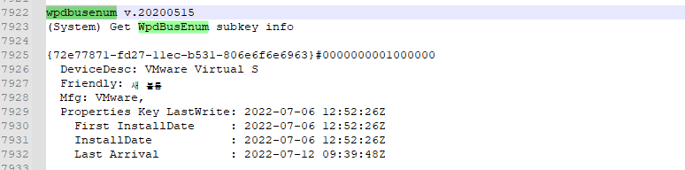

# **레지스트리 분석**

## **REGA**

표준 시간대를 설정한 뒤 확인 버튼을 클릭한다.

설정 값과 레지스트리가 담긴 폴더를 선택 후 분석 시작 버튼을 클릭한다.

우측 도구 상자에서 주로 봐야할 정보를 쉽게 볼 수 있게 지원한다.

## **Regripper**

rip.exe는 CLI기반이고 rr.exe는 GUI기반으로 플러그인을 통해 레지스트리를 분석하여 텍스트파일로 추출된다.

rr.exe에서 레지스트리 파일(NTUSER.DAT, DEFAULT 등)을 불러오고 분석된 텍스트파일을 저장할 경로를 설정한 뒤 rip! 버튼을 클릭한다.

생성된 텍스트파일을 열고 [찾고 싶은 키워드](http://forensic.korea.ac.kr/DFWIKI/index.php/RegRipper)로 찾아서 분석된 내용을 확인해 볼 수 있다.

