# Registry

윈도우 운영체제와 응용 프로그램 운영에 필요한 정보를 담고 있는 계층형 데이터베이스

# **INDEX**

**1. [레지스트리 구성](#레지스트리-구성)**

**2. [시스템 표준 시간](#시스템-표준-시간)**

**3. [시스템 정보](#시스템-정보)**

**4. [환경 변수 정보](#환경-변수-정보)**

**5. [사용자 계정 정보](#사용자-계정-정보)**

**6. [마지막 로그인 사용자](#마지막-로그인-사용자)**

**7. [자동 실행 프로그램](#자동-실행-프로그램)**

**8. [서비스](#서비스)**

**9. [응용 프로그램 정보](#응용-프로그램-정보)**

**10. [USB 연결 정보](#USB-연결-정보)**

**11. [최근 사용 기록](#최근-사용-기록)**

**12. [접근 폴더 정보](#접근-폴더-정보)**

**13. [공유 정보](#공유-정보)**

**14. [네트워크 정보](#네트워크-정보)**

**15. [RDP 정보](#RDP-정보)**

# **레지스트리 구성**

레지스트리는 다음과 같이 루트 키와 하위 키로 계층적으로 이루어져 있으며, 키는 값과 데이터 타입, 데이터로 구성되어 있다.

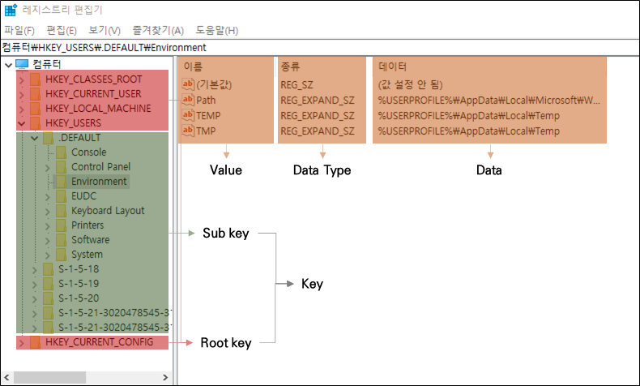

| Root key              | 약어  | 설명  |
| :---                  | :---  | :---  |
| HKEY_CLASSES_ROOT     | HKCR  | 파일 확장자 연결 정보, [COM](https://ko.wikipedia.org/wiki/%EC%BB%B4%ED%8F%AC%EB%84%8C%ED%8A%B8_%EC%98%A4%EB%B8%8C%EC%A0%9D%ED%8A%B8_%EB%AA%A8%EB%8D%B8) 객체 등록 정보            |
| HKEY_CURRENT_USER     | HKCU  | 현재 시스템에 로그인된 사용자의 프로파일 정보         |
| HKEY_LOCAL_MACHINE    | HKLM  | 시스템의 하드웨어, 소프트웨어 설정 및 기타 환경 정보  |
| HKEY_USERS            | HKU   | 시스템의 모든 사용자와 그룹에 관한 프로파일 정보      |
| HKEY_CURRENT_CONFIG   | HKCC  | 시스템이 시작할 때 사용되는 하드웨어 프로파일 정보    |

Root key는 다음과 같이 HKLM과 HKU로 구성된 Mater key와 HKCR, HKCU, HKCC로 구성된 Derived key로 구분할 수 있다.

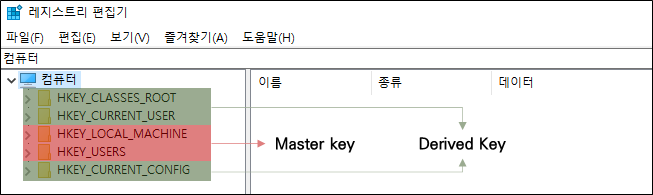

Derived Key는 Master key의 하위 키들의 데이터를 모아 놓은 키이다.

| Key   | 설명  |
| :---  | :---  |
| HKCR  | HKLM\SOFTWARE\Classes, HKU\\{SID}_Classes의 하위키 모음 |
| HKCU  | HKU의 사용자 프로파일 중 로인한 사용자의 하위키 모음 |
| HKCC  | HKLM\SYSTEM\CurrentControlSet\Hardware Profiles\Current의 하위키 모음 |

# **시스템 표준 시간**

경로 : HKLM\SYSTEM\CurrentControlSet\Control\TimeZoneInformation

| 값                | 설명  |
| :---              | :---  |
| Bias              | UTC와의 시간 차이 |
| StandardName      | 표준 시간대의 표준 시간을 나타내는 이름 |
| TimeZoneKeyName   | 표준 시간대의 이름 |

## **Bias**

데이터를 살펴보면 0xfffffde4 (4294966756)로 나와있다.

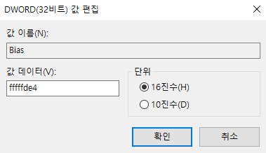

bias의 데이터는 unsigned로 나타나 있지만, [integer encoder](https://cryptii.com/pipes/integer-encoder)에서 big endian에 I32로 변환하면 -540이 나온다.

혹은 -(0xffffffff + 1 -0xfffffde4)으로 연산하여 -540값을 얻을 수 있다.

-540은 분을 표기한것으로 시간대가 UTC + 9시간임을 알 수 있다.

## **StandardName**

데이터를 살펴보면 @tzres.dll, -622로 나와있다.

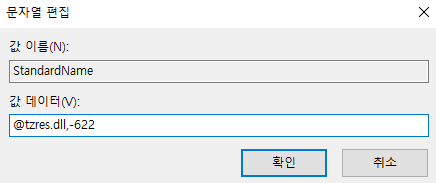

[tzres.dll](https://windows10dll.nirsoft.net/tzres_dll.html)에서 622라는 String ID를 살펴보면 Korea Standard Time임을 알 수 있고, Bias와 일치한다.

## **TimeZoneKeyName**

데이터를 살펴보면 Korea Standard Time로 나와있다.

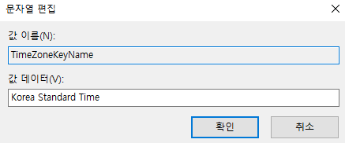

이는 Bias과 일치하는 시간대이다.

# **시스템 정보**

경로 : HKLM\SOFTWARE\Microsoft\Windows NT\CurrentVersion

| 값                                        | 설명  |
| :---                                      | :---  |
| CurrentBuild CurrentBuildNumber        | 운영체제 세부 버전 |
| InstallDate InstallTime                | 운영체제 설치 시간 |
| ProductId                                 | 운영체제 식별자 |
| ProductName                               | 운영체제 이름 |
| RegisteredOrganization RegisteredOwner | 조직 이름 사용자 이름 |
| ReleaseId                                 | 운영체제 버전 |
| SystemRoot                                | 운영체제 설치 경로 |

## **CurrentBuild(Number)**

운영체제의 세부 버전을 나타낸다.

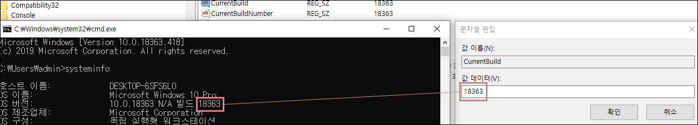

## **InstallDate/InstallTime**

운영체제의 설치 시간을 나타낸다.

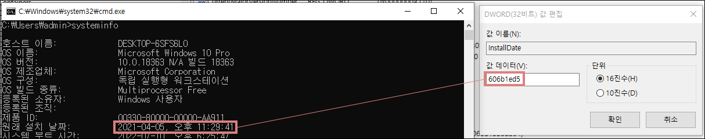

데이터는 Unix 시간 형식을 가지고 있으며 [DCode](https://www.digital-detective.net/dcode/)로 변환하여 운영 체제의 설치 시간을 확인할 수 있다.

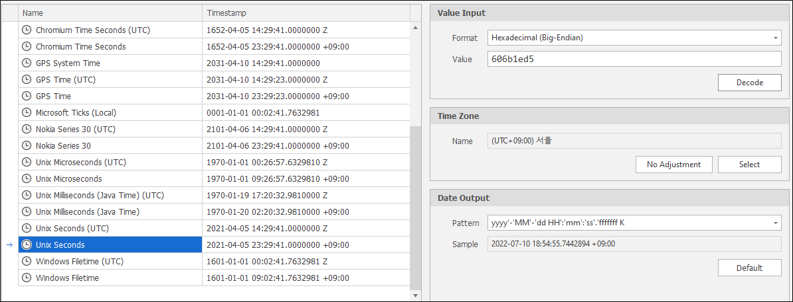

InstallTime도 마찬가지로 DCode를 이용하여 시간을 구할 수 있다.

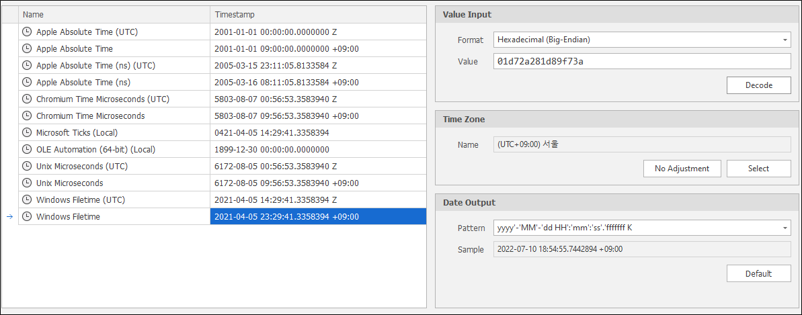

## **ProductId**

제품 ID를 나타낸다.

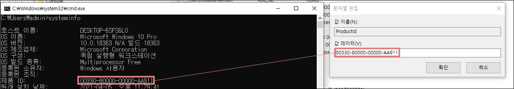

## **ProductName**

운영체제 이름을 나타낸다.

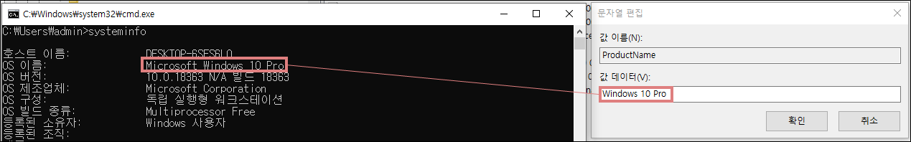

## **RegisteredOrganization/RegisteredOwner**

등록된 조직과 사용자를 나타낸다.

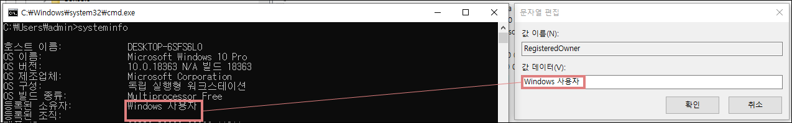

## **ReleaseId**

운영체제 버전을 나타낸다.

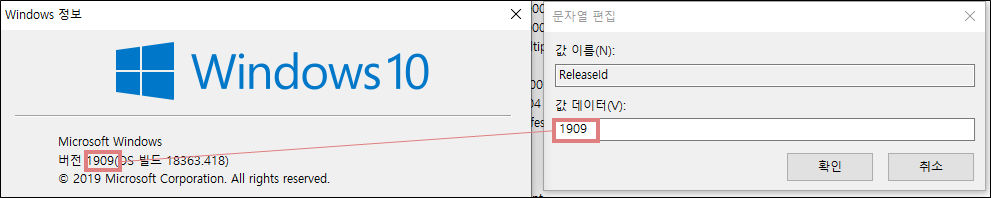

## **SystemRoot**

운영체제 경로를 나타낸다.

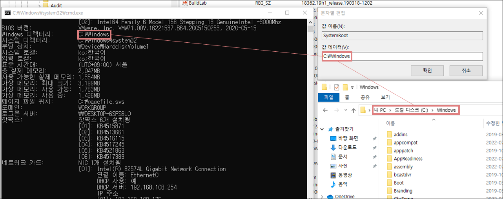

# **환경 변수 정보**

## **사용자에 대한 환경 변수**

경로 : HKU\\{SID}\Environment

## **시스템 변수**

경로 : HKLM\SYSTEM\CurrentControlSet\Control\Session Manager\Environment

# **사용자 계정 정보**

경로 : HKLM\SOFTWARE\Microsoft\Windows NT\CurrentVersion\ProfileList

ProfileList는 다음과 같이 하위 여러 키가 존재한다.

| 서브 키       | 설명  |
| :---          | :---  |
| S-1-5-18      | systemprofile     |
| S-1-5-19      | LocalService      |
| S-1-5-20      | NetworkService    |
| S-1-5-21      | 사용자 계정 (SID) |

## **SID (Security Identifier)**

다음과 같은 사용자 계정을 통해 설명해본다.

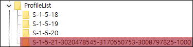

| SID 구분                          | 설명 |
| :---                              | :--- |
| S                                 | SID임을 나타내는 식별자   |
| 1                                 | SID 세부 버전 |
| 5                                 | 권한 식별자 0 : Null 1 : World 2 : Local 3 : Creator 4 : Non-unique 5 : NT 9 : Resource Manager   |
| 3020478545-3170550753-3008797825  | 도메인이나 로컬 컴퓨터 식별자 |
| 1000                              | RID (Relative ID) 500 : 관리자 계정 1xxx : 사용자 계정 |

## **마지막 로그인 시간**

사용자 SID 키의 LocalProfileLoadTimeHigh 값과 LocalProfileLoadTimeLow 값을 통해서 사용자의 마지막 로그인 시간을 알 수 있다.

LocalProfileLoadTimeHigh가 0x1d8943f이고 LocalProfileLoadTimeLow가 0x15b33afc라면 0x1d8943f15b33afc로 값을 알아내면 된다.

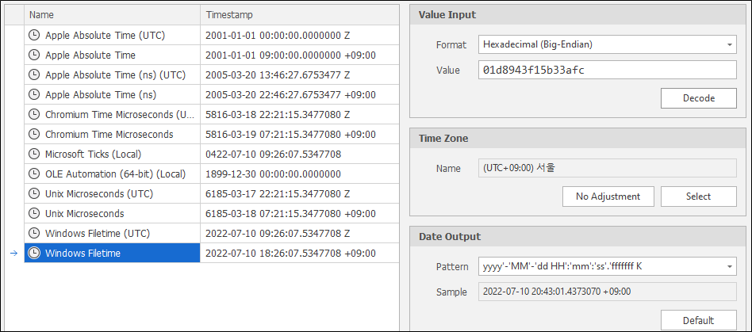

## **마지막 로그아웃 시간**

로그인과 마찬가지로 LocalProfileUnLoadTimeHigh 값과 LocalProfileUnLoadTimeLow 값을 통해서 사용자의 마지막 로그아웃 시간을 알 수 있다.

# **마지막 로그인 사용자**

경로 : HKLM\SOFTWARE\Microsoft\Windows NT\CurrentVersion\Winlogon

| 값                | 설명  |
| :---              | :---  |
| AutoAdminLogon    | 자동 로그인 설정 1 : 활성화 (DefaultUserName과 DefaultPassword가 설정되어 있는 경우) 0 : 비활성화 |
| AutoLogonSID      | 자동 로그인 시 사용자의 SID |
| LastUsedUsername  | 마지막으로 로그인한 사용자 |

# **자동 실행 프로그램**

시스템 부팅 시 스케줄러와 별개로 자동으로 실행되는 프로그램 정보들은 아래와 같이 레지스트리에 등록되어 있다.

경로는 다음과 같다.

    HKLM\SOFTWARE\Microsoft\Windows\CurrentVersion\Run
    HKLM\SOFTWARE\Microsoft\Windows\CurrentVersion\RunOnce
    HKLM\SOFTWARE\Microsoft\Windows\CurrentVersion\RunOnceEx
    HKCU\SOFTWARE\Microsoft\Windows\CurrentVersion\Run
    HKCU\SOFTWARE\Microsoft\Windows\CurrentVersion\RunOnce
    HKCU\SOFTWARE\Microsoft\Windows\CurrentVersion\RunOnceEx

# **서비스**

경로 : HKLM\SYSTEM\CurrentControlSet\Services

Services에 여러가지 서비스 및 드라이버에 해당하는 하위 키들이 존재한다.

하위 키의 값은 

| 값        | 설명  |
| :---      | :---  |
| ImagePath | 실행파일의 경로   |
| Start     | 서비스가 시작되는 방법 0x00 : 부트 로더에 의해 로드된 후 커널 초기화 중 시작 0x01 : I/O 하위 시스템에 의해 로드된 후 초기화 중 시작 0x02 : 서비스 컨트롤러(services.exe) 또는 세션 관리자(smss.exe)에 의해 자동으로 시작 0x03 : 사용자가 수동으로 시작 0x04 : 서비스를 시작하지 않음 0x05: 지연 시작 |
| Type      | 서비스의 유형 0x01 : 커널 장치 드라이버 0x02 : 파일 시스템 드라이버 0x04 : 어댑터에 대한 인수 집합 0x08 : 파일 시스템 드라이버 서비스 0x10 : 서비스 컨트롤러에 의해 시작되는 Win32 프로그램 0x20 : 다른 Win32 서비스 프로세스와 공유 가능한 Win32 서비스 0x60 : USER_SHARE_PROCESS 템플릿 |

# **응용 프로그램 정보**

## **설치된 프로그램 목록**

경로 : HKLM\SOFTWARE\Microsoft\Windows\CurrentVersion\Uninstall

## **프로그램의 실행 정보**

경로 : HKCU\SOFTWARE\Microsoft\Windows\CurrentVersion\Explorer\UserAssist

실행한 프로그램 목록, 마지막 실행 시간, 실행 횟수가 기록된다.

그 중 다음의 하위키들을 살펴본다.

| OS    | Key   | 설명  |
| :---  | :---  | :---  |
| ​Windows 2000 Windows XP Windows Vista Windows Server 2003   | {5E6AB780-7743-11CF-A12B-00AA004AE837}\Count {75048700-EF1F-11D0-9888-006097DEACF9}\Count  | 실행파일의 실행기록 바로가기의 실행 기록   |
| Windows 7 Windows 8 Windows 10 Windows 11    | {CEBFF5CD-ACE2-4F4F-9178-9926F41749EA}\Count {F4E57C4B-2036-45F0-A9AB-443BCFE33D9F}\Count  | 실행파일의 실행기록 바로가기의 실행 기록   |

값들은 [ROT13](https://ko.wikipedia.org/wiki/ROT13)으로 인코딩되어 있기 때문에 ROT13으로 디코딩하여 읽을 수 있다.

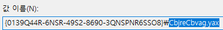

데이터에서 0x04 ~ 0x07 offset까지는 실행한 횟수이며 0x3C ~ 0x43 offset까지는 마지막 실행 시간을 나타낸다.

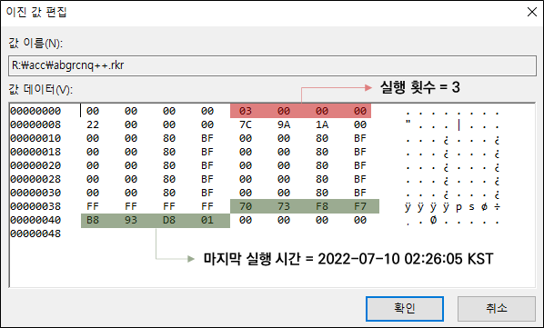

## **최근 열람 파일 정보**

경로 : HKCU\SOFTWARE\Microsoft\Windows\CurrentVersion\Explorer\ComDlg32\OpenSavePidlMRU
경로 : HKCU\SOFTWARE\Microsoft\Windows\CurrentVersion\Explorer\ComDlg32\LastVisitedPidlMRU

열기 혹은 저장 기능으로 사용된 파일들을 확장자 별로 모아져있으며, 어떤 파일이 열렸는지 확인이 가능하다.

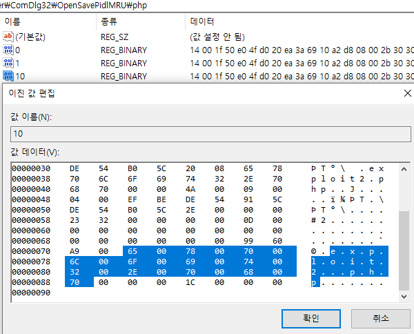

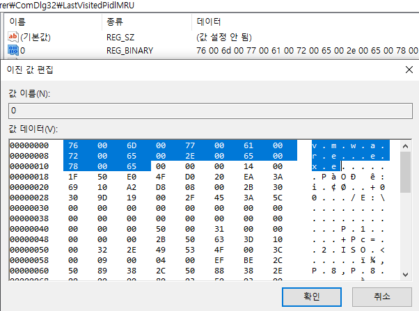

# **USB 연결 정보**

## **USB 인식 과정**

1. 버스 드라이버는 Plug & Play Manager에게 고유 식별정보를 전송하며 이벤트를 알림
2. Plug & Play Manager는 받은 정보를 기반으로 Device Class ID를 설정 후 드라이버 검색
3. 드라이버가 없을 경우 USB 펌웨어로부터 드라이버를 전달받아 기록

    HKLM\SYSTEM\ControlSet001\Enum\USBSTOR\\{DID}

    HKLM\SYSTEM\CurrentControlSet\Control\DeviceClasses\\{GUID}

4. 드라이버 설치 과정을 로그에 기록 : %SystemRoot%\INF\Setupapi.dev.log

## **USB 정보 확인**

경로 : HKLM\SYSTEM\ControlSet001\Enum\USBSTOR

하위 키들은 장치 클래스 ID(Device Class Indentifier)로 구성된다.

    Disk&Ven_{제조사}&Prod_{제품명}&Rev_{버전}

장치 클래스 ID의 하위 키는 해당 장치의 Serial number로 구성된다.

    {Serial Number}&#

Serial Number가 존재하지 않는 경우 Plug & Play Manager에 의해 임의의 번호가 다음과 같이 부여된다.
    
    #${Random Number}$#

## **제조사와 제품 ID 확인**

경로 : HKLM\SYSTEM\ControlSet001\Enum\USB

하위 키들은 제조사의 ID와 제품 ID로 구성된다.

    VID_{제조사 ID}&PID_{제품 ID}

[제소사 ID와 제품 ID 검색](#https://devicehunt.com/view/type/usb/vendor/090C/device/1000)을 통해 제조사와 제품을 알아 볼 수 있다.

USB와 USBTOR는 연관성이 있다.

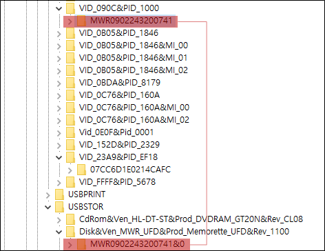

## **드라이브 문자**

경로 : HKLM\SOFTWARE\Microsoft\Windows Search\VolumeInfoCache
경로 : HKLM\SYSTEM\MountedDevices

# **최근 사용 기록**

## **최근 파일 열람 목록**

경로 : HKCU\SOFTWARE\Microsoft\Windows\CurrentVersion\Explorer\RecentDocs

확장자 별로 하위 키들이 구성되어 있으며 MRUListEx에서 열어본 순서의 정보가 있다.

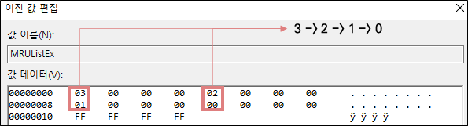

해당 숫자를 가지는 값의 데이터를 보면 파일 명을 알 수 있다.

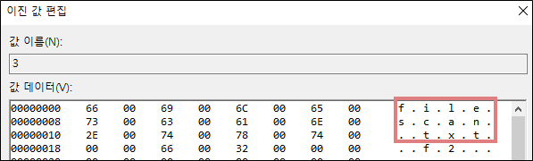

## **최근 명령 실행 목록**

경로 : HKCU\SOFTWARE\Microsoft\Windows\CurrentVersion\Explorer\RunMRU

MRUList에 입력한 순서가 표시되며 알파벳을 가지는 값의 데이터에는 입력한 데이터가 있다.

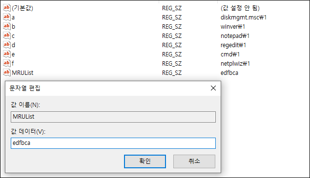

# **접근 폴더 정보**

사용자가 접근한 폴더 정보를 가지고 있으면 경로는 다음과 같다.

    HKCU\SOFTWARE\Classes\Local Settings\Software\Microsoft\Windows\Shell\Bags
    HKCU\SOFTWARE\Classes\Local Settings\Software\Microsoft\Windows\Shell\BagMRU
    HKCU\SOFTWARE\Microsoft\Windows\Shell\Bags
    HKCU\SOFTWARE\Microsoft\Windows\Shell\BagMRU

BagMRU는 폴더의 구조를 계층적 구조로 나타내며 Bags은 윈도우 사이즈, 위치 등 사용자의 환경설정을 저장한다.

# **공유 정보**

경로 : HKLM\SYSTEM\\{ControlSet00x}\Services\LanmanServer\Shares

기본적으로 설정되어 있는 공유목록이 아닌 항목에 대한 정보를 나타낸다.

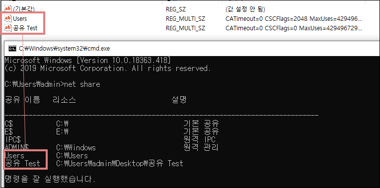

# **네트워크 정보**

## **인터페이스 GUID**

경로 : HKLM\SOFTWARE\Microsoft\Windows NT\CurrentVersion\NetworkCards

하위 키에 네트워크 인터페이스들의 정보가 담긴 키가 존재하며, ServiceName의 데이터에 GUID가 존재한다.

## **인터페이스 정보**

경로 : HKLM\SYSTEM\ControlSet001\Services\Tcpip\Parameters\Interfaces\\{GUID}

DHCP 방식일 때 DhcpIPAddress에 IP 주소가 있으며, Static일 때는 IPAddress라는 값에 주소가 있다.

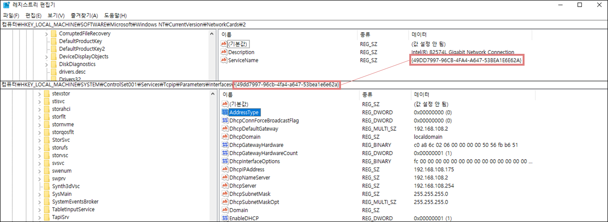

# **RDP 정보**

## **최근 연결 정보**

경로 : HKU\\{SID}\SOFTWARE\Microsoft\Terminal Server Client\Default

MRUx 식의 값들이 존재하며 x가 낮을 수 록 최근에 수행한 RDP 서버의 IP 정보이다.

## **모든 연결 정보**

경로 : HKU\\{SID}\SOFTWARE\Microsoft\Terminal Server Client\Servers

연결을 수행했던 RDP 서버의 IP들이 하위 키로 구성되며, 인증서의 Hash나 로그인 계정 정보가 있다.