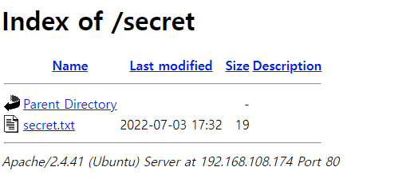

# Directory Listing

디렉토리의 파일 및 폴더 등이 노출되어 정보를 획득

# **INDEX**

**1. [환경 구성](#환경-구성)**

**2. [Directory Listing](#Directory-Listing)**

# **환경 구성**

| Type          | Version                   |
| :---          | :---                      |
| OS            | Ubuntu 20.04.3 LTS        |
| Architecture  | x86-64                    |
| IP            | 192.168.108.174           |
| apache2       | 2.4.41-4ubuntu3.10        |

apache와 php를 사용하기 위해 관련 패키지를 설치하자.

```sh
root@ubuntu:~# apt -y install apache2
```

디렉토리 리스팅을 통해 확인할 파일을 만들자.

```sh
root@ubuntu:~# cd /var/www/html
root@user:/var/www/html# mkdir secret
root@user:/var/www/html# echo 'Top Secret Message' > secret/secret.txt
```

# **Directory Listing**

secret으로 디렉토리를 접근하면 다음과 같이 디렉토리 내 정보를 획득할 수 있다.

