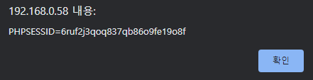
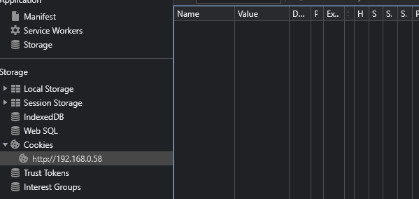
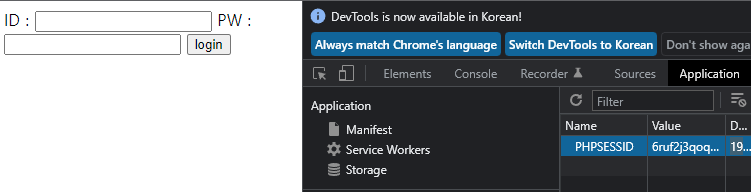
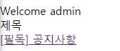
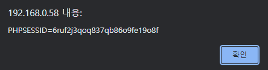

# XSS (Cross Site Scripting)

악의적인 스크립트를 삽입한 페이지를 방문한 사용자는 악성 스크립트가 실행되어 cookie 등 민감한 정보를 탈취당한다.

# **INDEX**

**1. [환경 구성](#환경-구성)**

**2. [Stored XSS](#Stored-XSS)**
 
**3. [Reflected XSS](#Reflected-XSS)**

# **환경 구성**

| Type          | Version                   |
| :---          | :---                      |
| OS            | Ubuntu 20.04.3 LTS        |
| Architecture  | x86-64                    |
| IP            | 192.168.0.58              |
| apache2       | 2.4.41-4ubuntu3.10        |
| php           | 7.4.3                     |
| mariadb       | 10.3.34-0ubuntu0.20.04.1  |

apache, php와 데이터베이스를 사용하기 위해 관련 패키지를 설치하자.

```sh
root@ubuntu:~# apt -y install apache2 php mariadb-server php-mysql
```

root비밀번호를 설정하고 데이터베이스, 테이블을 생성한 뒤 데이터를 넣자.

```sh
root@ubuntu:~# mysql_secure_installation
Enter current password for root (enter for none):
Set root password? [Y/n] Y
New password:
Re-enter new password:
Remove anonymous users? [Y/n] Y
Disallow root login remotely? [Y/n] n
Remove test database and access to it? [Y/n] Y
Reload privilege tables now? [Y/n] Y
root@ubuntu:~# mysql -u root -p'root'
MariaDB [(none)]> create database test;
MariaDB [(none)]> use test;
MariaDB [test]> create table user (id varchar(30), pw varchar(30));
MariaDB [test]> insert into user(id,pw) values('admin','helloworld');
MariaDB [test]> insert into user(id,pw) values('test','test');
MariaDB [test]> create table board (subject varchar(255), contents text);
```

생성한 데이터베이스로 접근할 수 있는 권한을 부여하자.

```sh
MariaDB [(none)]> grant all privileges on test.* to 'root'@localhost identified by 'root';
MariaDB [(none)]> flush privileges;
```

이후 php.ini를 수정하여 데이터베이스 관련 함수를 사용할 수 있도록 하자.

```ini
extension=mysqli.so
```

로그인 페이지(index.php)를 생성하자.

```php
<?php
    session_start();
	if (isset($_GET['userid']) && isset($_GET['password'])) {
		$conn = mysqli_connect("localhost", "root", "root", "test");
		if (!$conn) die("mysql connect error : ".mysqli_connect_error($conn));
		$sql = "SELECT id, pw FROM user WHERE id='".$_GET['userid']."' and pw='".$_GET['password']."'";
		$result = mysqli_query($conn, $sql);
		$row = mysqli_fetch_array($result);
		if ($row) {
            $_SESSION['id'] = $row['id'];
            echo "<meta http-equiv='refresh' content='0; url=/main.php'>";
        }
		else echo "Login Failed";
		mysqli_close($conn);
	} elseif (isset($_SESSION['id'])) {
        echo "<meta http-equiv='refresh' content='0; url=/main.php'>";
    } else {
?>
<html>
	<body>
		<form action="/index.php" method="get">
			<label>ID : </label><input type="text" name="userid" required>
			<label>PW : </label><input type="password" name="password" required>
			<input type="submit" value="login">
		</form>
	</body>
</html>
<?php
	}
?>
```

XSS에 취약한 게시판과 같은 페이지(main.php)를 생성하자.

```php
<?php
    session_start();
    echo "Welcome ".$_SESSION['id'];
?>
<br>
제목
<br>
<a href="view.php?subject=notice "style="cursor: pointer;">[필독] 공지사항</a>
```

게시글을 보는 페이지(view.php)를 생성하자.

```php
<?php
    if (isset($_GET['subject'])) {
        if ($_GET['subject'] == 'notice') echo "<script>alert(document.cookie);</script>";
        else echo $_GET['subject']."를(을) 찾을 수 없습니다.";
    }
?>
```

# **Stored XSS**

공격자(test)가 악성 스크립트가 포함된 게시글을 작성해야하는데 편의상 작성하였다고 치자.

index.php에서 관리자(admin)로 로그인하자.

| data	| value	|
| :---	| :--- 	|
| ID	| admin |
| PW	| helloworld |
| URL	| http://192.168.0.58/index.php?userid=admin&password=helloworld |

"[필독] 공지사항"을 클릭하면 admin의 세션값을 확인할 수 있다.

공격자가 관리자의 세션값을 얻으려면 alert가 아닌 공격자의 서버로 cookie값을 보내야 하지만 편의상 alert로 띄웠다.



PHPSESSID값을 없애주자.



index.php로 가면 새로운 세션값을 얻을 수 있는데, 관리자의 세션값으로 엎어씌워주자.



이후 새로고침하면 관리자로 로그인됨을 확인할 수 있다.



# **Reflected XSS**

PHPSESSID값이 존재한다면 삭제해주고, index.php에서 관리자(admin)로 로그인하자.

| data	| value	|
| :---	| :--- 	|
| ID	| admin |
| PW	| helloworld |
| URL	| http://192.168.0.58/index.php?userid=admin&password=helloworld |

view.php에 subject값으로 notice를 제외한 값을 넣으면 찾을 수 없다고 한다.

| data	    | value	|
| :---	    | :--- 	|
| subject   | hello |
| URL	    | http://192.168.0.58/view.php?subject=hello |

이때, 공격자가 다음의 URL을 관리자에게 전달하였다고 가정하자.

    http://192.168.0.58/view.php?subject=<script>alert(document.cookie);</script>

관리자의 세션값을 가진상태로 해당 URL에 접속하면 관리자의 세셥값을 확인할 수 있다.

공격자가 관리자의 세션값을 얻으려면 alert가 아닌 공격자의 서버로 cookie값을 보내야 하지만 편의상 alert로 띄웠다.



PHPSESSID값을 없애주자.


index.php로 가면 새로운 세션값을 얻을 수 있는데, 관리자의 세션값으로 엎어씌워주자.


이후 새로고침하면 관리자로 로그인됨을 확인할 수 있다.

